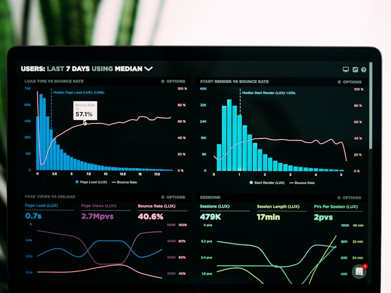

+++
title = 'AI Engineering ตอนที่ 4: Dataset สำหรับวิจัย - คู่มือฉบับสมบูรณ์'
date = 2026-04-09T23:12:00+07:00
draft = false
tags = ['ai-engineering', 'dataset', 'data-science', 'machine-learning', 'research']
categories = ['Tutorial', 'Community Development', 'AI']
image = 'cover.jpg'
description = 'Dataset คืออะไร ทำไมสำคัญสำหรับ AI แหล่งข้อมูล Dataset ฟรี วิธีสร้าง Dataset เอง และ Data Cleaning 12 ขั้นตอน'
+++

# 📊 AI Engineering ตอนที่ 4: Dataset สำหรับวิจัย - คู่มือฉบับสมบูรณ์

**ซีรีส์: AI Engineering สำหรับนักพัฒนาชุมชน**

---

**ผู้เขียน:** เหน่ง (นักวิชาการพัฒนาชุมชน)  
**สังกัด:** กรมการพัฒนาชุมชน กระทรวงมหาดไทย  
**วันที่:** 9 เมษายน 2569

---

## 📋 **สารบัญ**

1. [Dataset คืออะไร?](#dataset-คืออะไร)
2. [ทำไม Dataset สำคัญสำหรับ AI?](#ทำไม-dataset-สำคัญสำหรับ-ai)
3. [ประเภทของ Dataset](#ประเภทของ-dataset)
4. [แหล่งข้อมูล Dataset ฟรี](#แหล่งข้อมูล-dataset-ฟรี)
5. [วิธีสร้าง Dataset เอง](#วิธีสร้าง-dataset-เอง)
6. [การทำความสะอาดข้อมูล (Data Cleaning)](#การทำความสะอาดข้อมูล-data-cleaning)
7. [Use Cases สำหรับงานวิจัย/ชุมชน](#use-cases-สำหรับงานวิจัยชุมชน)

---

## 📌 **Dataset คืออะไร?**


*ภาพ: แนวคิด Dataset - ภาพประกอบจาก Unsplash*

---

**Dataset (ชุดข้อมูล)** คือ การนำข้อมูลที่มีคุณสมบัติเหมือนกันมาจัดเป็นชุดให้ถูกต้องตามโครงสร้างข้อมูล

ลองนึกภาพง่ายๆ ว่ามันเหมือนกับ:

- 📝 **ตาราง Excel** หรือ Spreadsheet
- 📋 **สมุดบันทึก** ที่เก็บข้อมูลลูกค้า
- 🗃️ **แฟ้มเอกสาร** ที่จัดหมวดหมู่ไว้อย่างดี

---

### **โครงสร้างของ Dataset:**

| ชื่อ | อายุ | เพศ | อาชีพ | รายได้ต่อเดือน |
|------|------|-----|-------|----------------|
| สมชาย | 28 | ชาย | พนักงานบริษัท | 25,000 บาท |
| สมใจ | 35 | หญิง | ธุรกิจส่วนตัว | 45,000 บาท |
| วิชัย | 42 | ชาย | ข้าราชการ | 30,000 บาท |
| มาลี | 26 | หญิง | พนักงานบริษัท | 22,000 บาท |

จากตารางนี้:

- **แถว (Row)** = 1 ตัวอย่าง (1 คน) → เรียกว่า "Sample" หรือ "Data Point"
- **คอลัมน์ (Column)** = คุณสมบัติของข้อมูล → เรียกว่า "Feature" หรือ "Attribute"

---

> 💡 **อ่านเพิ่มเติม:** [ตอนที่ 3: RAG](/posts/ai-engineering-part-3/) - วิธีเชื่อมต่อ AI กับฐานข้อมูล

---

## ❤️ **ทำไม Dataset สำคัญสำหรับ AI?**

---

มีสุภาษิตของคนในวงการ AI ที่ว่า:

> **"ข้อมูลคือหัวใจของ AI"** 💯

หรือพูดอีกแบบคือ **"Garbage In, Garbage Out"** 🗑️

หมายความว่า ถ้าข้อมูลไม่ดี โมเดล AI ก็ไม่สามารถเรียนรู้ได้อย่างถูกต้อง

---

### **บทบาทของ Dataset ใน 3 ขั้นตอน:**

| ขั้นตอน | คำอังกฤษ | คำอธิบาย | ทำไมถึงสำคัญ |
|---------|----------|----------|-------------|
| **การฝึก** | Training | Dataset ให้ตัวอย่างที่โมเดลใช้เรียนรู้รูปแบบ | เป็นพื้นฐานให้โมเดล "จำ" และ "เข้าใจ" รูปแบบของข้อมูล |
| **การตรวจสอบ** | Validation | ช่วยปรับแต่งประสิทธิภาพของโมเดล | ใช้ตรวจสอบว่าโมเดลทำงานได้ดีแค่ไหน ก่อนนำไปใช้จริง |
| **การทดสอบ** | Testing | ข้อมูลที่ไม่เคยเห็น ใช้วัดความสามารถจริงของโมเดล | เป็นการทดสอบของจริงว่าโมเดลทำงานได้ดีจริงหรือไม่ |

---

### **ตัวอย่างจริง:**

**สมมติเราจะสร้าง AI ทำนายราคาบ้าน**

🏠 **Training Data:**
- บ้าน 1,000 หลัง พร้อมราคาจริง
- AI เรียนรู้ว่า "บ้าน 3 ห้องนอน อยู่ในเมือง ราคาเท่าไหร่"

🏠 **Validation Data:**
- บ้าน 200 หลัง
- ใช้ปรับแต่งโมเดลว่า "ควรให้น้ำหนักอะไรมากกว่ากัน"

🏠 **Testing Data:**
- บ้าน 100 หลัง ที่ AI ไม่เคยเห็น
- ถ้าทำนายได้ใกล้เคียงราคาจริง = โมเดลดี!

---

## 🗂️ **ประเภทของ Dataset**

---

### **1. แบ่งตามการกำกับข้อมูล (Labeling):**

#### **Labeled Data (ข้อมูลมีป้ายกำกับ)**

คือข้อมูลที่มีการระบุคำตอบหรือหมวดหมู่ไว้ชัดเจน

| รูปภาพ | ป้ายกำกับ |
|--------|----------|
| 🐱 | แมว |
| 🐕 | สุนัข |
| 🐱 | แมว |
| 🦅 | นก |

**ข้อดี:** โมเดลเรียนรู้ได้ตรงไปตรงมา เพราะรู้คำตอบแล้ว

**ข้อเสีย:** ต้องใช้แรงงานคนในการติดป้าย (Labeling) ทำให้มีราคาแพง

---

#### **Unlabeled Data (ข้อมูลไม่มีป้ายกำกับ)**

คือข้อมูลดิบที่ไม่มีการระบุคำตอบ

**ตัวอย่าง:**
- รูปภาพหลายพันรูป (ไม่ได้บอกว่าคืออะไร)
- ข้อความอีเมลหลายพันฉบับ (ไม่ได้บอกว่าอันไหนสแปม)

**ข้อดี:** หาได้ง่าย มีเยอะ ไม่ต้องใช้แรงงานในการติดป้าย

**ข้อเสีย:** ยากกว่าในการสอนโมเดล ต้องใช้เทคนิคพิเศษ

---

#### **Semi-Supervised Data (ข้อมูลกึ่งกำกับ)**

คือการผสมระหว่าง 2 แบบข้างบน

**ตัวอย่าง:**
- รูปภาพ 10,000 รูป แต่มีป้ายเพียง 1,000 รูป
- อีเมล 100,000 ฉบับ แต่รู้ว่า 5,000 ฉบับเป็นสแปม

**ข้อดี:** ใช้ประโยชน์จากข้อมูลที่มีป้ายน้อยๆ ให้เรียนรู้ข้อมูลที่ไม่มีป้ายด้วย

---

### **2. แบ่งตามโครงสร้าง:**

#### **Structured Data (ข้อมูลมีโครงสร้าง)**

ข้อมูลที่จัดเก็บในรูปแบบที่เป็นระเบียบ มีช่องให้กรอกชัดเจน

**ตัวอย่าง:**
- ฐานข้อมูลลูกค้า
- Excel ข้อมูลพนักงาน
- ตารางราคาสินค้า

**ข้อดี:** วิเคราะห์ง่าย เข้าถึงง่าย ใช้พื้นที่น้อย

---

#### **Unstructured Data (ข้อมูลไม่มีโครงสร้าง)**

ข้อมูลที่ไม่มีรูปแบบตายตัว อยู่ในรูปแบบอิสระ

**ตัวอย่าง:**
- 📝 ข้อความ (Text)
- 🖼️ รูปภาพ (Image)
- 🎵 เสียง (Audio)
- 🎬 วิดีโอ (Video)

**ความท้าทาย:** ต้องใช้เทคนิคพิเศษ เช่น NLP หรือ Computer Vision ในการวิเคราะห์

---

## 🆓 **แหล่งข้อมูล Dataset ฟรี**

---

### **1. Kaggle — สวรรค์ของ Data Scientist** 🥇

**Kaggle** เป็นแพลตฟอร์มที่ได้รับความนิยมมากที่สุดในโลกสำหรับ Data Science

**จุดเด่น:**
- มี Dataset หลายหมื่นชุดข้อมูล
- มีทั้งผู้เชี่ยวชาญและมือใหม่แชร์ข้อมูล
- สามารถดู Discussion และ Code ของคนอื่นได้
- มี Competitions ที่ให้ลองทักษะ

**ลิงก์:** [kaggle.com/datasets](https://www.kaggle.com/datasets)

---

### **2. UCI Machine Learning Repository** 🏛️

**UCI ML Repository** เป็นแหล่งข้อมูลคลาสสิกที่มีชื่อเสียงมากๆ ในวงการ Machine Learning

**จุดเด่น:**
- มี Dataset กว่า 689 ชุดข้อมูล
- ข้อมูลส่วนใหญ่ clean และพร้อมใช้งาน
- เหมาะสำหรับมือใหม่เริ่มต้น
- มีเอกสารอธิบายข้อมูลชัดเจน

**ลิงก์:** [archive.ics.uci.edu](https://archive.ics.uci.edu)

---

### **3. Google Dataset Search** 🔍

**Google Dataset Search** เป็นเครื่องมือค้นหา Dataset จากหลายแหล่งทั่วโลก

**จุดเด่น:**
- ค้นหาข้อมูลจากหลายแหล่งในครั้งเดียว
- รองรับหลายหัวข้อ
- มีตัวกรองวันที่ ประเภทข้อมูล
- แสดงข้อมูล License ให้เห็นชัดเจน

**ลิงก์:** [datasetsearch.research.google.com](https://datasetsearch.research.google.com)

---

### **4. data.world** 🌍

**data.world** เป็นแพลตฟอร์มที่น่าสนใจมากๆ เพราะสามารถทำงานกับข้อมูลได้โดยตรงบนเว็บไซต์

**จุดเด่น:**
- ทำงานบนเว็บได้โดยไม่ต้องติดตั้งโปรแกรม
- รองรับ SQL Query
- มี API ให้ใช้งาน
- ชุมชน active แชร์ข้อมูลบ่อย

**ลิงก์:** [data.world](https://data.world)

---

### **5. World Bank Data** 🏦

สำหรับคนที่สนใจข้อมูลด้านเศรษฐกิจ สังคม และการพัฒนา

**จุดเด่น:**
- ข้อมูลเศรษฐกิจและสังคมจากทั่วโลก
- อัปเดตสม่ำเสมอ
- มี Visualization ในตัว
- ดาวน์โหลดได้หลายรูปแบบ (CSV, Excel, XML)

**ลิงก์:** [data.worldbank.org](https://data.worldbank.org)

---

**ตารางสรุปแหล่งข้อมูล Dataset ฟรี:**

| แหล่ง | จุดเด่น | ลิงก์ |
|-------|---------|------|
| **Kaggle** | Dataset หลากหลาย มี Community ใหญ่ | kaggle.com/datasets |
| **UCI ML** | ข้อมูลคลาสสิก 689+ ชุด เหมาะเริ่มต้น | archive.ics.uci.edu |
| **Google Dataset Search** | ค้นหาข้อมูลจากทุกแหล่ง | datasetsearch.research.google.com |
| **data.world** | ทำงานบนเว็บได้ รองรับ SQL | data.world |
| **World Bank Data** | ข้อมูลเศรษฐกิจ-สังคมระดับโลก | data.worldbank.org |

---

## 🛠️ **วิธีสร้าง Dataset เอง**

---

บางครั้งการหา Dataset จากข้างนอกมาใช้อาจไม่ตรงกับความต้องการของเรา การสร้าง Dataset เองก็เป็นอีกทางเลือกที่น่าสนใจ

---

### **ขั้นตอนที่ 1: กำหนดวัตถุประสงค์** 🎯

ตอบคำถามเหล่านี้ก่อน:

- ต้องการข้อมูลอะไร (What)
- เอาไปใช้ทำอะไร (How)
- ใครจะเป็นคนใช้ (Who)
- ต้องการข้อมูลกี่ชุด/กี่รายการ (How much)

**ตัวอย่าง:** "อยากสร้าง Dataset รีวิวร้านอาหารไทย เพื่อใช้วิเคราะห์ความรู้สึกของลูกค้า (Sentiment Analysis) จำนวน 10,000 รีวิว"

---

### **ขั้นตอนที่ 2: รวบรวมข้อมูล (Data Collection)** 📥

#### **Primary Data (ข้อมูลปฐมภูมิ):**

ข้อมูลที่เราเก็บเองโดยตรงจากแหล่งข้อมูล:

- **แบบสอบถาม (Survey):** ส่งให้กลุ่มเป้าหมายตอบ
- **การสัมภาษณ์ (Interview):** พูดคุยเก็บข้อมูลเชิงลึก
- **การสังเกต (Observation):** เก็บข้อมูลจากการดู/ใช้งานจริง
- **การทดลอง (Experiment):** เก็บข้อมูลจากการทดลองที่เราควบคุม

---

#### **Secondary Data (ข้อมูลทุติยภูมิ):**

ข้อมูลที่มีคนเก็บไว้แล้ว เรานำมาใช้:

- **ข้อมูลจากเว็บไซต์ (Web Scraping):** ดึงข้อมูลจากเว็บ
- **API:** ดึงข้อมูลจากบริการต่างๆ เช่น X (Twitter) API, Google Maps API
- **ข้อมูลจากหน่วยงานราชการ:** สถิติ กรมต่างๆ
- **ข้อมูลจากงานวิจัย:** งานวิจัยเก่าที่เปิดเผยต่อสาธารณะ

---

### **ขั้นตอนที่ 3: จัดโครงสร้างข้อมูล (Data Structuring)** 📋

1. **กำหนด Column/Field:** แต่ละคอลัมน์เก็บข้อมูลอะไร
2. **กำหนด Data Type:** ข้อมูลเป็น Text, Number, Date หรืออื่นๆ
3. **สร้างไฟล์:** ใช้รูปแบบ CSV, JSON, Excel หรือ Database
4. **กำหนด Primary Key:** หมายเลขหรือ ID ที่ไม่ซ้ำกัน

---

### **ขั้นตอนที่ 4: ติดป้ายกำกับ (Labeling)** 🏷️

สำหรับงาน Machine Learning เราต้องมี "Label" หรือ "คำตอบ" ให้โมเดลเรียนรู้:

- **Classification:** ติดป้ายว่าข้อมูลอยู่ใน class ไหน เช่น Positive/Negative
- **Object Detection:** วาดกรอบรอบวัตถุ + ระบุชนิด
- **Sentiment Analysis:** ระบุว่ารีวิวเป็น ดี/เฉย/ไม่ดี

**วิธี Labeling:**
- ทำเอง (Manual Labeling)
- ใช้ Tool ช่วย เช่น Label Studio, Prodigy
- ใช้ Crowd-sourcing เช่น Amazon Mechanical Turk

---

### **ขั้นตอนที่ 5: เก็บรักษาและจัดการ (Storage & Management)** 💾

- **เลือกรูปแบบไฟล์:** CSV สำหรับข้อมูลตาราง, JSON สำหรับข้อมูลซับซ้อน
- **สร้าง Documentation:** อธิบายว่าแต่ละ Column คืออะไร
- **Version Control:** เก็บหลายเวอร์ชัน เผื่อต้องย้อนกลับ
- **Backup:** สำรองข้อมูลไว้หลายที่
- **License:** กำหนดว่าใครใช้ได้บ้าง

---

## 🧹 **การทำความสะอาดข้อมูล (Data Cleaning)**

---

ได้ยินมั้ยครับ ที่ชาว Data Science พูดว่า **"80% ของเวลาทำงานคือการทำความสะอาดข้อมูล"** 😱

ข้อมูลดิบที่เราได้มามักมีปัญหาหลายอย่าง เช่น ข้อมูลหาย ข้อมูลซ้ำ ข้อมูลผิดรูปแบบ ถ้าไม่แก้ไขก่อน โมเดลที่เราสร้างก็จะมีปัญหาได้

---

### **12 ขั้นตอน Data Cleaning:**

| ขั้นตอน | สิ่งที่ทำ | เครื่องมือ |
|---------|---------|-----------|
| 1 | ตรวจสอบ Missing Values | `df.isnull().sum()` |
| 2 | ลบข้อมูลซ้ำ | `df.drop_duplicates()` |
| 3 | ตรวจสอบประเภทข้อมูล | `df.dtypes` |
| 4 | แก้ไขค่าผิดปกติ (Outliers) | IQR Method |
| 5 | จัดการ Missing Data | `df.dropna()` หรือ `df.fillna()` |
| 6 | ลบคอลัมน์ไม่จำเป็น | `df.drop(columns=[...])` |
| 7 | จัดการ Text Data | `.str.lower()`, `.str.strip()` |
| 8 | ตรวจสอบความสอดคล้อง | Condition checks |
| 9 | จัดการ Encoding | One-Hot, Label Encoding |
| 10 | Normalization/Standardization | MinMaxScaler, StandardScaler |
| 11 | บันทึกข้อมูลที่ทำความสะอาดแล้ว | `df.to_csv()` |
| 12 | สร้างเอกสาร (Documentation) | README, Data Dictionary |

---

## 🏛️ **Use Cases สำหรับงานวิจัย/ชุมชน**


*ภาพ: AI เพื่อสังคม - ภาพประกอบจาก Unsplash*

---

### **AI for Social Good (AI เพื่อสังคม):**

| ด้าน | ตัวอย่างการใช้ Dataset |
|------|----------------------|
| **สุขภาพ** | วิเคราะห์ภาพ X-ray วินิจฉัยโรค, พยากรณ์การระบาด |
| **การศึกษา** | GenAI เพื่อการศึกษาสำหรับผู้ด้อยโอกาส |
| **สิ่งแวดล้อม** | วิเคราะห์ข้อมูลสภาพอากาศ, พยากรณ์น้ำท่วม |
| **การเกษตร** | พยากรณ์ผลผลิต, ตรวจจับโรคพืช |
| **ความเหลื่อมล้ำ** | ระบุผู้ต้องการความช่วยเหลือทางสังคม |
| **ความปลอดภัย** | ตรวจจับการทุจริต, อาชญากรรม |

---

### **ตัวอย่างจริง:**

#### **1. สุขภาพ:**
```
- วิเคราะห์ภาพ X-ray วินิจฉัยโรคปอด
- พยากรณ์การระบาดของโรคติดเชื้อ
- ระบุผู้ป่วยที่มีความเสี่ยงสูง
```

---

#### **2. การศึกษา:**
```
- GenAI เพื่อการสอนพิเศษ
- วิเคราะห์ผลการเรียนเพื่อปรับปรุงหลักสูตร
- แนะนำเส้นทางการเรียนรู้ส่วนบุคคล
```

---

#### **3. สิ่งแวดล้อม:**
```
- วิเคราะห์ข้อมูลสภาพอากาศ
- พยากรณ์น้ำท่วม/ภัยแล้ง
- ติดตามการเปลี่ยนแปลงของป่าไม้
```

---

#### **4. การเกษตร:**
```
- พยากรณ์ผลผลิตพืชผล
- ตรวจจับโรคพืชจากภาพถ่าย
- แนะนำเวลาปลูกและเก็บเกี่ยว
```

---

### **หลักการสำคัญ:**

```
✅ ต้องมีข้อมูลที่มีคุณภาพ และ จริยธรรม
✅ ร่วมมือกับชุมชนท้องถิ่น เพื่อเข้าใจปัญหาจริง
✅ เน้น ความโปร่งใส และ ความเป็นธรรม (ไม่ Bias)
```

---

## 📚 **สรุป**

---

### **สิ่งที่ได้เรียนรู้:**

- ✅ **Dataset คืออะไร** — ชุดข้อมูลที่จัดอย่างเป็นระบบ
- ✅ **ทำไมสำคัญ** — "ข้อมูลคือหัวใจของ AI"
- ✅ **ประเภทของ Dataset** — Labeled, Unlabeled, Semi-Supervised
- ✅ **แหล่งข้อมูลฟรี** — Kaggle, UCI, Google Dataset Search
- ✅ **วิธีสร้าง Dataset เอง** — 5 ขั้นตอน
- ✅ **Data Cleaning** — 12 ขั้นตอนสำคัญ
- ✅ **Use Cases** — AI เพื่อสังคม

---

### **คำแนะนำ:**

```
💡 เริ่มจาก Dataset เล็กๆ ก่อน
💡 ใช้ Dataset ฟรีที่มีอยู่ก่อนสร้างเอง
💡 ทำความสะอาดข้อมูลให้ดีก่อนสอน AI
💡 เก็บเอกสารประกอบเสมอ
```

---

## 🔗 **อ่านบทความที่เกี่ยวข้อง:**

- [ตอนที่ 3: RAG](/posts/ai-engineering-part-3/) - วิธีเชื่อมต่อ AI กับฐานข้อมูล
- [ตอนที่ 5: Agentic AI](/posts/ai-engineering-part-5/) - เมื่อ AI ทำงานแทนคุณ
- [ตอนที่ 6: Fine-tuning](/posts/ai-engineering-part-6/) - ปรับแต่ง AI ให้เชี่ยวชาญ

---

## 📬 **ติดต่อได้ที่**

- **Telegram:** https://t.me/Majinman
- **Email:** jitaret@gmail.com

---

## 📚 **ซีรีส์อ้างอิง**

บทความชุดนี้เขียนโดยอ้างอิงจากหนังสือ **"AI Engineering"** โดย **Chip Huyen**

- 📖 **หนังสือ:** [AI Engineering](https://aie-book.com/)
- 🐙 **GitHub:** [chiphuyen/aie-book](https://github.com/chiphuyen/aie-book)
- 👩‍💻 **ผู้เขียน:** [Chip Huyen](https://huyenchip.com/)

**หมายเหตุ:** บทความชุดนี้ปรับเนื้อหาให้เหมาะกับบริบทของนักพัฒนาชุมชนไทย โดยเพิ่มตัวอย่าง Use Cases ในภาครัฐและชุมชน

---

---

## 📚 **อ่านบทความอื่นในซีรีส์**

| ตอน | หัวข้อ | ลิงก์ |
|-----|--------|-------|
| 1 | วางแผน AI App | [อ่านตอนที่ 1](/posts/ai-engineering-part-1/) |
| 2 | Prompt Engineering | [อ่านตอนที่ 2](/posts/ai-engineering-part-2/) |
| 3 | RAG | [อ่านตอนที่ 3](/posts/ai-engineering-part-3/) |
| 5 | Agentic AI | [อ่านตอนที่ 5](/posts/ai-engineering-part-5/) |
| 6 | Fine-tuning AI Models | [อ่านตอนที่ 6](/posts/ai-engineering-part-6/) |
| 7 | สรุปซีรีส์ | [อ่านตอนที่ 7](/posts/ai-engineering-part-7/) |

---

_ซีรีส์: AI Engineering สำหรับนักพัฒนาชุมชน_  
_ตอนที่ 4/7: Dataset สำหรับวิจัย_  
_โดย เหน่ง - นักวิชาการพัฒนาชุมชน_  
_กรมการพัฒนาชุมชน กระทรวงมหาดไทย_

---

**ขอบคุณที่ติดตามครับ!** 🙏

**พบกันใหม่ในตอนต่อไป!** 🚀
