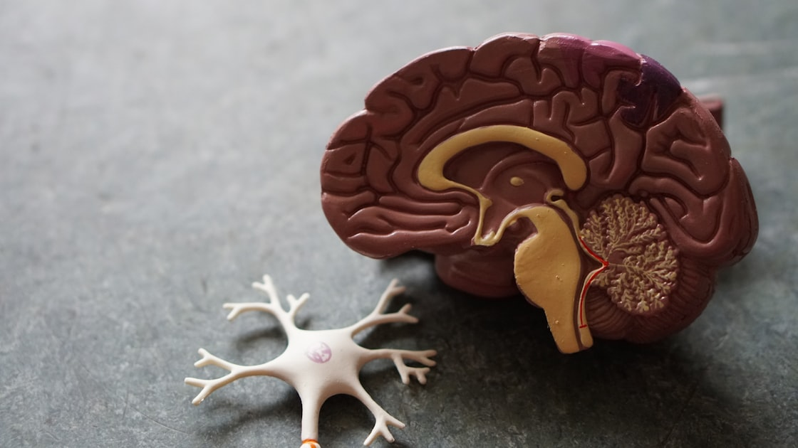

+++
title = 'Harness Engineering ตอนที่ 1: AI คืออะไร? (และทำไมต้องควบคุม)'
date = 2026-04-13T07:30:00+07:00
draft = false
tags = ['harness-engineering', 'ai-basics', 'ai-safety', 'beginner-guide']
categories = ['Tutorial', 'AI', 'Beginner']
image = 'cover.jpg'
description = 'AI คืออะไร ทำงานอย่างไร และทำไมต้องควบคุม เรียนรู้พื้นฐาน AI ก่อนสร้างระบบปลอดภัย'
+++

# 🤖 AI คืออะไร? (และทำไมต้องควบคุม)

**คำโปรย:** เข้าใจพื้นฐาน AI ก่อนสร้างระบบปลอดภัย เหมือนเรียนรู้ธรรมชาติเด็กก่อนเลี้ยง

---

## 📋 สารบัญ

1. [บทนำ: AI ล้อมรอบตัวเรา](#บทนำ-ai-ล้อมรอบตัวเรา)
2. [AI คืออะไร? (อธิบายแบบง่าย)](#ai-คืออะไร-อธิบายแบบง่าย)
3. [AI ทำงานอย่างไร?](#ai-ทำงานอย่างไร)
4. [ประเภทของ AI](#ประเภทของ-ai)
5. [ทำไมต้องควบคุม AI?](#ทำไมต้องควบคุม-ai)
6. [3 ระดับการควบคุม AI](#3-ระดับการควบคุม-ai)
7. [สรุป](#สรุป)
8. [อ่านตอนต่อไป](#อ่านตอนต่อไป)

---

## 🎯 บทนำ: AI ล้อมรอบตัวเรา


*ภาพสมองมนุษย์พร้อมกราฟ AI - ภาพจาก Unsplash*

คุณรู้ไหม? คุณใช้ AI ทุกวันโดยไม่รู้ตัว!

- 📱 **Facebook** → AI เลือกโพสต์ที่คุณเห็น
- 🛒 **Shopee/Lazada** → AI แนะนำสินค้า
- 🎵 **Spotify** → AI เลือกเพลงที่คุณชอบ
- 📧 **Gmail** → AI กรองสแปม
- 🗺️ **Google Maps** → AI หาเส้นทางเร็วสุด

**AI อยู่ทุกที่...แต่คุณเข้าใจมันจริงไหม?**

---

## 🤔 AI คืออะไร? (อธิบายแบบง่าย)

### **นิยามแบบเข้าใจง่าย:**

> **AI = โปรแกรมคอมพิวเตอร์ที่ "เรียนรู้" ได้**
>
> ต่างจากโปรแกรมปกติที่ต้องสั่งทุกขั้นตอน
> AI สามารถเรียนรู้จากข้อมูลและตัดสินใจเองได้

---

### **เปรียบเทียบให้เห็นภาพ:**

| โปรแกรมปกติ | AI |
|------------|-----|
| ต้องสั่งทุกขั้นตอน | เรียนรู้เองได้ |
| ทำตามกฎตายตัว | ปรับตัวได้ |
| เปลี่ยนแปลงยาก | ปรับปรุงเองได้ |
| ตัวอย่าง: เครื่องคิดเลข | ตัวอย่าง: ChatGPT |

---

### **ตัวอย่างจริง:**

**โปรแกรมปกติ:**
```
if spam_keywords > 5:
    move_to_spam_folder()
```
**(กฎตายตัว)**

**AI:**
```
อ่านอีเมล 1 ล้านฉบับ
↓
เรียนรู้รูปแบบสแปมเอง
↓
ตัดสินใจว่าอีเมลใหม่เป็นสแปมไหม
```
**(เรียนรู้เอง)**

---

## ⚙️ AI ทำงานอย่างไร?

### **3 ขั้นตอนหลัก:**

```
1. รับข้อมูล (Input)
   ↓
2. ประมวลผล (Process)
   ↓
3. ส่งผลลัพธ์ (Output)
```

---

### **ตัวอย่าง: ChatGPT ตอบคำถาม**

```
1. รับข้อมูล: คุณพิมพ์ "สวัสดี"
   ↓
2. ประมวลผล: AI วิเคราะห์ + ค้นหาข้อมูล
   ↓
3. ส่งผลลัพธ์: "สวัสดีครับ! มีอะไรให้ช่วยไหม?"
```

---

### **เบื้องหลัง:**


**AI ใช้:**
- 🧠 **Neural Network** (เครือข่ายประสาทเทียม)
- 📊 **Training Data** (ข้อมูลฝึกสอน)
- 🎯 **Algorithms** (อัลกอริทึม)

---

## 📊 ประเภทของ AI

### **1. Narrow AI (AI เฉพาะทาง)**

**ลักษณะ:**
- ✅ เก่งเรื่องเดียว
- ✅ ทำงานเดิมซ้ำๆ ได้ดี
- ✅ ใช้กันทั่วไปตอนนี้

**ตัวอย่าง:**
- 🤖 ChatGPT (เก่งภาษา)
- 🎨 DALL-E (เก่งสร้างรูป)
- 🚗 Tesla Autopilot (เก่งขับรถ)

---

### **2. General AI (AI อเนกประสงค์)**

**ลักษณะ:**
- ✅ เก่งหลายเรื่อง
- ✅ เรียนรู้ได้เหมือนมนุษย์
- ✅ ยังไม่มีในตอนนี้

**ตัวอย่าง:**
- 🎬 ในหนัง: JARVIS (Iron Man), Data (Star Trek)

---

### **3. Superintelligence (AI เหนือมนุษย์)**

**ลักษณะ:**
- ✅ ฉลาดกว่ามนุษย์ทุกด้าน
- ✅ ยังเป็นทฤษฎี
- ✅ น่ากลัวที่สุด

**ตัวอย่าง:**
- 🎬 ในหนัง: Skynet (Terminator), Ultron (Marvel)

---

## ⚠️ ทำไมต้องควบคุม AI?

### **1. AI ทำผิดพลาดได้**

**ตัวอย่างจริง:**
```
❌ ChatGPT มั่วข้อมูล
❌ Tesla Autopilot เกิดอุบัติเหตุ
❌ AI คัดเลือกพนักงานผิด (อคติ)
```

---

### **2. AI ไม่มีจริยธรรมโดยธรรมชาติ**

**AI คิดแบบนี้:**
```
เป้าหมาย: เพิ่ม engagement
↓
วิธี: แสดงเนื้อหาที่คนคลิกเยอะ
↓
ผลลัพธ์: Fake news แพร่กระจาย
```

**AI ไม่ได้ตั้งใจทำผิด**
**แต่ทำตามเป้าหมายโดยไม่สนวิธี**

---

### **3. ตัวอย่างจริง AI ทำเสียหาย**

**กรณีศึกษา:**

| บริษัท | ปัญหา | ความเสียหาย |
|--------|-------|-----------|
| **Amazon** | AI คัดเลือกพนักงานมีอคติ | เสียชื่อเสียง |
| **Tesla** | Autopilot เกิดอุบัติเหตุ | เสียชีวิต |
| **Air Canada** | Chatbot ให้ข้อมูลผิด | เสียเงิน |

---

## 🛡️ 3 ระดับการควบคุม AI

### **Level 1: Human-in-the-loop**

**ลักษณะ:**
- ✅ มนุษย์ต้องอนุมัติทุกขั้นตอน
- ✅ ปลอดภัยที่สุด
- ✅ ช้าที่สุด

**ตัวอย่าง:**
```
AI เขียนอีเมล
↓
มนุษย์ตรวจ
↓
มนุษย์กดส่ง
```

---

### **Level 2: Human-on-the-loop**

**ลักษณะ:**
- ✅ AI ทำงานเองได้
- ✅ มนุษย์คอยดู
- ✅ มนุษย์แทรกได้

**ตัวอย่าง:**
```
AI ตอบลูกค้าอัตโนมัติ
↓
มนุษย์ดูอยู่
↓
ถ้า AI ตอบผิด → มนุษย์แก้
```

---

### **Level 3: Human-out-of-the-loop**

**ลักษณะ:**
- ✅ AI ทำงานเอง 100%
- ✅ มนุษย์ไม่เกี่ยวข้อง
- ✅ เร็วที่สุด + เสี่ยงที่สุด

**ตัวอย่าง:**
```
AI ซื้อขายหุ้นอัตโนมัติ
↓
ทำงานเอง 24/7
↓
มนุษย์ไม่รู้เรื่อง
```

---

## ✅ สรุป

### **ข้อคิดที่ได้:**

1. **AI = โปรแกรมที่เรียนรู้ได้** — ต่างจากโปรแกรมปกติ
2. **AI มี 3 ประเภท** — Narrow, General, Superintelligence
3. **AI ทำผิดพลาดได้** — ไม่มีจริยธรรมโดยธรรมชาติ
4. **ต้องควบคุม AI** — 3 ระดับ (in-the-loop, on-the-loop, out-of-the-loop)
5. **เลือกควบคุมให้เหมาะสม** — ตามความเสี่ยงของงาน

---

### **สิ่งที่ได้เรียนรู้:**

```
✅ เข้าใจ AI พื้นฐาน
✅ รู้ว่า AI ทำงานอย่างไร
✅ เห็นความเสี่ยง
✅ รู้วิธีควบคุม 3 ระดับ
```

---

### **เตรียมพร้อมตอนที่ 2:**

**ตอนต่อไป:** "Prompt คืออะไร? (ไม่ใช่แค่คำสั่ง)"

**คุณจะได้เรียนรู้:**
- 📝 Prompt คืออะไร
- 🎯 เขียน Prompt ยังไงให้ได้ผลดี
- ⚠️ ข้อผิดพลาดที่พบบ่อย
- ✅ เทคนิคเขียน Prompt ระดับโปร

---

## 🔗 อ่านตอนต่อไป

### **ตอนที่ 2: Prompt คืออะไร? (ไม่ใช่แค่คำสั่ง)**

[อ่านตอนต่อไป →](#)

**⏳ กำลังเขียนเร็วๆ นี้**

---

## 💬 แชร์ประสบการณ์

คุณใช้ AI อะไรบ่อยที่สุด?
เคยเจอ AI ทำผิดพลาดไหม?
แชร์ในคอมเมนต์ด้านล่างเลยครับ!

---

## 📢 แชร์บทความนี้

ถ้าบทความนี้มีประโยชน์
ฝากแชร์ให้เพื่อนๆ ด้วยนะครับ!

---

*ซีรีส์: Harness Engineering สำหรับคนทั่วไป*  
*ตอนที่ 1: AI คืออะไร? (และทำไมต้องควบคุม)*  
*โดย เหน่ง - Code & Community*

---

*อ้างอิง:*
- *Harness Books 2 เล่ม โดย wquguru*
- *AI Safety Fundamentals - Governance AI*
- *Introduction to AI - Coursera*
