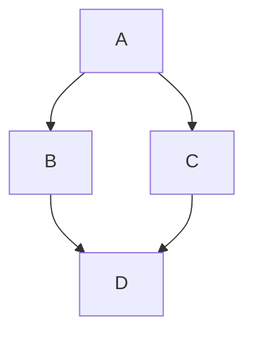

+++
title = 'คู่มือ Hugo Stack Theme ฉบับสมบูรณ์'
date = 2026-04-06T19:00:00+07:00
draft = false
tags = ['hugo', 'stack', 'theme', 'guide', 'tutorial']
categories = ['Tutorial', 'Documentation']
image = 'cover.jpg'
description = 'คู่มือการใช้งาน Hugo Stack Theme ทุกฟีเจอร์ ตั้งแต่ติดตั้งจนถึงปรับแต่งขั้นสูง'
+++

# 📚 คู่มือ Hugo Stack Theme ฉบับสมบูรณ์

**อัพเดท:** 2026-04-06  
**เวอร์ชัน:** Hugo Stack v4  
**Hugo:** 0.157.0+ extended

---

## 📋 สารบัญ

1. [ข้อมูลเบื้องต้น](#ข้อมูลเบื้องต้น)
2. [การติดตั้ง](#การติดตั้ง)
3. [การตั้งค่า (Configuration)](#การตั้งค่า-configuration)
4. [การเขียนบทความ](#การเขียนบทความ)
5. [Widgets](#widgets)
6. [Menu](#menu)
7. [ฟีเจอร์พิเศษ](#ฟีเจอร์พิเศษ)
8. [การปรับแต่งขั้นสูง](#การปรับแต่งขั้นสูง)

---

## 📖 ข้อมูลเบื้องต้น

### Hugo Stack คืออะไร?

**Hugo Stack** คือธีมสำหรับ Hugo แบบ card-style ที่ออกแบบมาสำหรับ blogger โดยเฉพาะ

### ฟีเจอร์หลัก:

| ฟีเจอร์ | คำอธิบาย |
|---------|----------|
| 🌙 **Dark Mode** | โหมดมืดอัตโนมัติตามระบบ |
| 📱 **Responsive** | รองรับทุกอุปกรณ์ |
| 🌐 **Multilingual** | รองรับหลายภาษา |
| 🔍 **Local Search** | ค้นหาในเว็บ |
| 📑 **Table of Contents** | สารบัญบทความ |
| 🖼️ **Image Gallery** | แกลเลอรี่รูปภาพ |
| ⚡ **Fast** | เร็วและเบา (ไม่มี framework) |

---

## 🚀 การติดตั้ง

### วิธีที่ 1: ใช้ Starter Template (แนะนำ)

```bash
git clone https://github.com/CaiJimmy/hugo-theme-stack-starter my-blog
cd my-blog
hugo server
```

### วิธีที่ 2: Hugo Module

```bash
# Initialize module
hugo mod init github.com/me/my-blog

# Add theme to config
# hugo.toml
[[module.imports]]
  path = "github.com/CaiJimmy/hugo-theme-stack/v4"

# Update theme
hugo mod get -u github.com/CaiJimmy/hugo-theme-stack/v4
hugo mod tidy
```

### วิธีที่ 3: Git Submodule

```bash
git submodule add https://github.com/CaiJimmy/hugo-theme-stack/ themes/hugo-theme-stack
```

---

## ⚙️ การตั้งค่า (Configuration)

### 1. **Sidebar** (แถบด้านข้าง)

```toml
[params.sidebar]
  compact = false          # โหมด compact
  emoji = "👋"             # Emoji ด้านบน
  subtitle = "คำอธิบายสั้นๆ"
  avatar = "img/profile.jpg"  # รูปโปรไฟล์ (ต้องอยู่ใน assets/img/)
```

**ตำแหน่งรูปโปรไฟล์:**
```
assets/
└── img/
    └── profile.jpg  ← วางรูปที่นี่
```

---

### 2. **Article** (บทความ)

```toml
[params.article]
  headingAnchor = false    # แสดง # ข้างหัวข้อ
  math = false             # เปิดใช้ KaTeX (สมการคณิตศาสตร์)
  toc = true               # แสดงสารบัญ
  readingTime = true       # แสดงเวลาอ่าน
  
  [params.article.license]
    enabled = true
    default = "CC BY-NC 4.0"
```

**Mermaid Diagrams:**
```toml
[params.article.mermaid]
  look = "classic"         # classic หรือ handDrawn
  lightTheme = "default"   # ธีมสำหรับ light mode
  darkTheme = "dark"       # ธีมสำหรับ dark mode (สลับธีมอัตโนมัติ)
  securityLevel = "strict"
```

---

### 3. **Widgets** (วิดเจ็ตด้านขวา)

```toml
[[params.widgets.homepage]]
  type = "search"

[[params.widgets.homepage]]
  type = "archives"
  [params.widgets.homepage.params]
    limit = 10

[[params.widgets.homepage]]
  type = "categories"
  [params.widgets.homepage.params]
    limit = 10

[[params.widgets.homepage]]
  type = "tag-cloud"
  [params.widgets.homepage.params]
    limit = 10
```

**Widgets ที่มี:**

| Widget | คำอธิบาย | Params |
|--------|---------|--------|
| `search` | ช่องค้นหา | - |
| `archives` | รายการปี | `limit` |
| `categories` | หมวดหมู่ | `limit` |
| `toc` | สารบัญ | - |
| `tag-cloud` | แท็ก | `limit` |
| `taxonomy` |  taxonomy กำหนดเอง | `taxonomy`, `limit`, `icon` |

---

### 4. **Menu** (เมนู)

**วิธีที่ 1: เพิ่มใน Front Matter (แนะนำ)**

```yaml
---
title: "บทความ"
menu:
  main:
    name: "บทความ"
    weight: -90
    params:
      icon: "article"
---
```

**วิธีที่ 2: เพิ่มใน Config**

```toml
[[menu.main]]
  name = "Home"
  url = "/"
  weight = 1
  identifier = "home"
  [menu.main.params]
    icon = "home"
    newTab = false

[[menu.main]]
  name = "Posts"
  url = "/posts/"
  weight = 2
  identifier = "posts"
  [menu.main.params]
    icon = "archive"
```

**Social Menu:**

```toml
[[menu.social]]
  name = "GitHub"
  url = "https://github.com/yourusername"
  weight = 1
  [menu.social.params]
    icon = "github"
    newTab = true
```

---

## ✍️ การเขียนบทความ

### โครงสร้างไฟล์ (Page Bundles)

```
content/
└── posts/
    └── my-first-post/
        ├── index.md       ← เนื้อหา
        ├── image1.png     ← รูป
        └── image2.png
```

### Front Matter

```yaml
---
title = "ชื่อบทความ"
date = 2026-04-06T19:00:00+07:00
draft = false
tags = ["tag1", "tag2"]
categories = ["Category"]
image = "image1.png"  # รูปปก
description = "คำอธิบายสั้นๆ"
slug = "my-first-post"
toc = true            # เปิด/ปิดสารบัญ
math = true           # เปิด/ปิด KaTeX
license = "CC BY-NC"  # License (override)
---
```

### การใส่รูป

```markdown


```

**Image Gallery:**

```markdown
 

```

จะแสดงเป็น 2 แถว (2 รูปบน, 1 รูปล่าง)

---

## 🎨 ฟีเจอร์พิเศษ

### 1. **Dark Mode**

- เปิด/ปิดอัตโนมัติตามระบบ
- หรือคลิกปุ่ม Dark Mode ใน sidebar

### 2. **Local Search**

ต้องสร้างหน้า Search ก่อน:

```bash
hugo new search/_index.md
```

**Front Matter:**
```yaml
---
title: "Search"
layout: "search"
---
```

### 3. **Archives**

```bash
hugo new archives/_index.md
```

**Front Matter:**
```yaml
---
title: "Archives"
layout: "archives"
---
```

### 4. **Math Typesetting (KaTeX)**

**เปิดใน config:**
```toml
[params.article]
  math = true
```

**หรือเปิดในบทความ:**
```yaml
---
math = true
---
```

**ใช้:**
```markdown
Inline: $E = mc^2$

Block:
$$
E = mc^2
$$
```

### 5. **Mermaid Diagrams**

**เปิดใน config:**
```toml
[params.article.mermaid]
  enabled = true
```

**ใช้:**
```markdown

```

---

## 🔧 การปรับแต่งขั้นสูง

### 1. **Custom CSS**

สร้างไฟล์: `assets/scss/custom.scss`

```scss
// ตัวอย่าง: เปลี่ยนสี accent
:root {
  --accent-color: #your-color;
}

// เปลี่ยนฟอนต์
body {
  font-family: 'Your Font', sans-serif;
}
```

### 2. **Custom Icons**

ดาวน์โหลด SVG จาก [Tabler Icons](https://tabler-icons.io)

วางที่: `assets/icons/your-icon.svg`

**ใช้:**
```toml
[menu.main.params]
  icon = "your-icon"
```

### 3. **Override Theme Files**

คัดลอกไฟล์จาก theme มาที่โปรเจกต์:

```
themes/hugo-theme-stack/layouts/_partials/header.html
→
layouts/_partials/header.html
```

แก้ไขไฟล์ใน `layouts/` จะ override theme

### 4. **Multilingual**

```toml
[languages]
  [languages.en]
    languageName = "English"
    title = "My Blog"
    weight = 1
    
  [languages.th]
    languageName = "ไทย"
    title = "บล็อกของฉัน"
    weight = 2
```

---

## 📊 สรุปการตั้งค่าที่สำคัญ

### hugo.toml (ตัวอย่างเต็ม)

```toml
baseURL = "https://example.com/"
title = "บล็อกของฉัน"
theme = "hugo-theme-stack"
languageCode = "th-th"

[params]
  description = "บล็อกส่วนตัว"
  defaultTheme = "auto"
  mainSections = ["posts"]
  
  [params.sidebar]
    emoji = "👋"
    subtitle = "คำอธิบาย"
    avatar = "img/profile.jpg"
  
  [params.article]
    toc = true
    readingTime = true
    
    [params.article.license]
      enabled = true
      default = "CC BY-NC 4.0"
  
  [params.widgets.homepage]
    - type = "search"
    - type = "archives"
    - type = "categories"
    - type = "tag-cloud"

[menu]
  [[menu.main]]
    name = "Home"
    url = "/"
    weight = 1
    [menu.main.params]
      icon = "home"
  
  [[menu.social]]
    name = "GitHub"
    url = "https://github.com/username"
    weight = 1
    [menu.social.params]
      icon = "github"

[languages]
  [languages.th]
    languageName = "ไทย"
    weight = 1
```

---

## 🔗 ลิงก์ที่เป็นประโยชน์

| แหล่ง | ลิงก์ |
|------|-------|
| **Official Docs** | https://stack.cai.im/ |
| **GitHub Repo** | https://github.com/CaiJimmy/hugo-theme-stack |
| **Demo** | https://demo.stack.cai.im/ |
| **Starter Template** | https://github.com/CaiJimmy/hugo-theme-stack-starter |
| **Tabler Icons** | https://tabler-icons.io |

---

## 💡 เคล็ดลับ

1. **ใช้ Page Bundles** — จัดการรูปและเนื้อหาในโฟลเดอร์เดียวกัน
2. **ใช้ Starter Template** — เริ่มต้นง่าย มี GitHub Actions ให้แล้ว
3. **Custom CSS ใน assets/scss/** — ไม่ต้องแก้ theme
4. **ใช้ Front Matter menu** — เมนูจะ highlight อัตโนมัติ
5. **รูปต้องอยู่ใน assets/** — สำหรับ avatar และรูปในธีม

---

**อัพเดทล่าสุด:** 2026-04-06  
**เขียนโดย:** เหน่ง

---

_เอกสารนี้อ้างอิงจาก [Hugo Stack Official Documentation](https://stack.cai.im/)_
