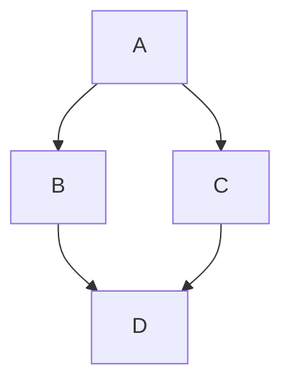

+++
title = 'คู่มือ Hugo Stack Theme ฉบับสมบูรณ์'
date = 2026-04-06T19:00:00+07:00
draft = false
tags = ['hugo', 'stack', 'theme', 'guide', 'tutorial']
categories = ['Tutorial', 'Documentation']
image = 'cover.jpg'
description = 'คู่มือการใช้งาน Hugo Stack Theme ทุกฟีเจอร์ ตั้งแต่ติดตั้งจนถึงปรับแต่งขั้นสูง'
takeaways = [
  "Hugo Stack คือธีม card-style สำหรับ blogger รองรับ Dark Mode, Responsive, Multilingual, และ Local Search",
  "ติดตั้งด้วย Git Submodule หรือ Hugo Modules — อัพเดทธีมง่ายโดยไม่กระทบเนื้อหา",
  "ฟีเจอร์เด่น: TOC Widget, Related Posts, Reading Time, Series Navigation, PhotoSwipe Gallery"
]
+++

# 📚 คู่มือ Hugo Stack Theme ฉบับสมบูรณ์

**อัพเดท:** 2026-04-10  
**เวอร์ชัน:** Hugo Stack v4  
**Hugo:** 0.160.0+ extended (April 2026)

---

## 📋 สารบัญ

1. [ข้อมูลเบื้องต้น](#ข้อมูลเบื้องต้น)
2. [การติดตั้ง](#การติดตั้ง)
3. [การใช้ธีม Stack](#การใช้ธีม-stack) 🆕
4. [การตั้งค่า (Configuration)](#การตั้งค่า-configuration)
5. [การเขียนบทความ](#การเขียนบทความ)
6. [Widgets](#widgets)
7. [Menu](#menu)
8. [ฟีเจอร์พิเศษ](#ฟีเจอร์พิเศษ)
9. [การปรับแต่งขั้นสูง](#การปรับแต่งขั้นสูง)
10. [Troubleshooting](#troubleshooting) 🆕
11. [Deployment](#deployment) 🆕
12. [Performance Optimization](#performance-optimization) 🆕
13. [SEO & Analytics](#seo--analytics) 🆕

---

## 📖 ข้อมูลเบื้องต้น

### Hugo Stack คืออะไร?

**Hugo Stack** คือธีมสำหรับ Hugo แบบ card-style ที่ออกแบบมาสำหรับ blogger โดยเฉพาะ

### ฟีเจอร์หลัก:

| ฟีเจอร์ | คำอธิบาย |
|---------|----------|
| 🌙 **Dark Mode** | โหมดมืดอัตโนมัติตามระบบ |
| 📱 **Responsive** | รองรับทุกอุปกรณ์ |
| 🌐 **Multilingual** | รองรับหลายภาษา |
| 🔍 **Local Search** | ค้นหาในเว็บ |
| 📑 **Table of Contents** | สารบัญบทความ |
| 🖼️ **Image Gallery** | แกลเลอรี่รูปภาพ |
| ⚡ **Fast** | เร็วและเบา (ไม่มี framework) |

---

## 🎨 การใช้ธีม Stack

### 1. **โครงสร้างโฟลเดอร์**

```
my-blog/
├── assets/              # ไฟล์ต้นฉบับ (SCSS, JS)
│   ├── img/            # รูปภาพ
│   │   └── profile.jpg # รูปโปรไฟล์
│   └── scss/
│       └── custom.scss # CSS ส่วนตัว
├── content/            # เนื้อหาบทความ
│   ├── posts/         # บทความ
│   └── _index.md      # หน้าแรก
├── layouts/           # Template ส่วนตัว (override theme)
├── static/            # ไฟล์ static (ไม่ผ่าน Hugo processing)
├── themes/            # Theme files
│   └── hugo-theme-stack/
└── hugo.toml         # Config หลัก
```

---

### 2. **การปรับแต่งสี (Color Customization)**

**วิธีที่ 1: ใช้ Custom CSS (แนะนำ)**

สร้างไฟล์: `assets/scss/custom.scss`

```scss
// เปลี่ยนสีหลัก (Accent Color)
:root {
  --accent-color: #007bff;        // สีลิงก์, ปุ่ม
  --accent-color-darker: #0056b3; // สีเมื่อ hover
}

// เปลี่ยนสีพื้นหลัง Dark Mode
:root[data-scheme="dark"] {
  --body-background: #1a1a1a;
  --card-background: #2d2d2d;
}

// เปลี่ยนสีพื้นหลัง Light Mode
:root[data-scheme="light"] {
  --body-background: #f5f5f5;
  --card-background: #ffffff;
}
```

**วิธีที่ 2: แก้ใน Config**

```toml
[params]
  defaultTheme = "dark"  # light, dark, auto
```

---

### 3. **การเพิ่ม Font (Custom Fonts)**

**วิธีที่ 1: ใช้ Google Fonts**

1. เพิ่มใน `hugo.toml`:

```toml
[[params.headCustomHTML]]
  html = """<link rel="preconnect" href="https://fonts.googleapis.com">
<link rel="preconnect" href="https://fonts.gstatic.com" crossorigin>
<link href="https://fonts.googleapis.com/css2?family=Noto+Sans+Thai:wght@300;400;500;600;700&display=swap" rel="stylesheet">"""
```

2. ใช้ใน `assets/scss/custom.scss`:

```scss
body {
  font-family: 'Noto Sans Thai', sans-serif;
}

h1, h2, h3, h4, h5, h6 {
  font-family: 'Noto Sans Thai', sans-serif;
}
```

**วิธีที่ 2: ใช้ Font ในเครื่อง**

1. วางไฟล์ font ใน `static/fonts/`
2. เพิ่มใน `assets/scss/custom.scss`:

```scss
@font-face {
  font-family: 'My Font';
  src: url('/fonts/my-font.woff2') format('woff2');
  font-weight: normal;
  font-style: normal;
}

body {
  font-family: 'My Font', sans-serif;
}
```

---

### 4. **การปรับ Layout**

**Sidebar Compact Mode:**

```toml
[params.sidebar]
  compact = true  # true = โหมดเล็ก, false = โหมดปกติ
```

**เปลี่ยนตำแหน่ง Widgets:**

```toml
# Widgets ในหน้าแรก
[[params.widgets.homepage]]
  type = "search"

[[params.widgets.homepage]]
  type = "categories"

# Widgets ในหน้าบทความ
[[params.widgets.page]]
  type = "toc"  # สารบัญ
```

**ซ่อน Widgets:**

```toml
# ลบ widgets ออกทั้งหมด
[[params.widgets.homepage]]
  type = "disabled"
```

---

### 5. **การปรับ Avatar และ Emoji**

**เปลี่ยนรูปโปรไฟล์:**

```toml
[params.sidebar]
  avatar = "img/profile.jpg"  # วางรูปใน assets/img/
```

**เปลี่ยน Emoji:**

```toml
[params.sidebar]
  emoji = "👋"  # หรือ 🤖, 🎨, 📝, etc.
```

**เพิ่ม Subtitle:**

```toml
[params.sidebar]
  subtitle = "คำอธิบายสั้นๆ เกี่ยวกับบล็อก"
```

---

### 6. **การปรับ Article Layout**

**เปิด/ปิดฟีเจอร์:**

```toml
[params.article]
  toc = true              # เปิด/ปิดสารบัญ
  readingTime = true      # เปิด/ปิดเวลาอ่าน
  headingAnchor = true    # เปิด/ปิด # ข้างหัวข้อ
  math = false            # เปิด/ปิด KaTeX
  
  [params.article.license]
    enabled = true        # เปิด/ปิด License
    default = "CC BY-NC 4.0"
```

**Mermaid Diagrams:**

```toml
[params.article.mermaid]
  look = "classic"        # classic หรือ handDrawn
  lightTheme = "default"  # ธีม light mode
  darkTheme = "dark"      # ธีม dark mode
  securityLevel = "strict"
```

---

### 7. **การปรับ Image Processing**

**Lazy Loading (enabled by умолчанию):**

```toml
[params.imageProcessing]
  lazyLoading = true      # โหลดรูปเมื่อเลื่อนถึง
  enableWebP = true       # แปลงรูปเป็น WebP
  
  [params.imageProcessing.thumbnail]
    enabled = true        # สร้าง thumbnail
  
  [params.imageProcessing.content]
    enabled = true        # Responsive images
    widths = [400, 800, 1200, 1600]  # ขนาดที่จะสร้าง
```

**คุณภาพรูป:**

```toml
[imaging]
  quality = 80            # 0-100 (แนะนำ 75-85)
  resampleFilter = "lanczos"  # lanczos, catmullrom, linear
  anchor = "smart"        # smart, center, topLeft, etc.
```

---

### 8. **ตัวอย่างการตั้งค่าแบบเต็ม**

```toml
baseURL = "https://example.com/"
title = "บล็อกของฉัน"
theme = "hugo-theme-stack"
languageCode = "th-th"

[params]
  description = "บล็อกส่วนตัว"
  defaultTheme = "auto"
  mainSections = ["posts"]
  
  [params.sidebar]
    compact = false
    emoji = "👋"
    subtitle = "แบ่งปันความรู้และเทคโนโลยี"
    avatar = "img/profile.jpg"
  
  [params.article]
    toc = true
    readingTime = true
    headingAnchor = true
    math = false
    
    [params.article.license]
      enabled = true
      default = "CC BY-NC 4.0"
  
  [params.imageProcessing]
    lazyLoading = true
    enableWebP = true

[menu]
  [[menu.main]]
    name = "Home"
    url = "/"
    weight = 1
    [menu.main.params]
      icon = "home"
  
  [[menu.social]]
    name = "GitHub"
    url = "https://github.com/username"
    weight = 1
    [menu.social.params]
      icon = "github"
```

---

## 🚀 การติดตั้ง

### วิธีที่ 1: ใช้ Starter Template (แนะนำ)

```bash
git clone https://github.com/CaiJimmy/hugo-theme-stack-starter my-blog
cd my-blog
hugo server
```

### วิธีที่ 2: Hugo Module

```bash
# Initialize module
hugo mod init github.com/me/my-blog

# Add theme to config
# hugo.toml
[[module.imports]]
  path = "github.com/CaiJimmy/hugo-theme-stack/v4"

# Update theme
hugo mod get -u github.com/CaiJimmy/hugo-theme-stack/v4
hugo mod tidy
```

### วิธีที่ 3: Git Submodule

```bash
git submodule add https://github.com/CaiJimmy/hugo-theme-stack/ themes/hugo-theme-stack
```

---

## ⚙️ การตั้งค่า (Configuration)

### 1. **Sidebar** (แถบด้านข้าง)

```toml
[params.sidebar]
  compact = false          # โหมด compact
  emoji = "👋"             # Emoji ด้านบน
  subtitle = "คำอธิบายสั้นๆ"
  avatar = "img/profile.jpg"  # รูปโปรไฟล์ (ต้องอยู่ใน assets/img/)
```

**ตำแหน่งรูปโปรไฟล์:**
```
assets/
└── img/
    └── profile.jpg  ← วางรูปที่นี่
```

---

### 2. **Article** (บทความ)

```toml
[params.article]
  headingAnchor = false    # แสดง # ข้างหัวข้อ
  math = false             # เปิดใช้ KaTeX (สมการคณิตศาสตร์)
  toc = true               # แสดงสารบัญ
  readingTime = true       # แสดงเวลาอ่าน
  
  [params.article.license]
    enabled = true
    default = "CC BY-NC 4.0"
```

**Mermaid Diagrams:**
```toml
[params.article.mermaid]
  look = "classic"         # classic หรือ handDrawn
  lightTheme = "default"   # ธีมสำหรับ light mode
  darkTheme = "dark"       # ธีมสำหรับ dark mode (สลับธีมอัตโนมัติ)
  securityLevel = "strict"
```

---

### 3. **Widgets** (วิดเจ็ตด้านขวา)

```toml
[[params.widgets.homepage]]
  type = "search"

[[params.widgets.homepage]]
  type = "archives"
  [params.widgets.homepage.params]
    limit = 10

[[params.widgets.homepage]]
  type = "categories"
  [params.widgets.homepage.params]
    limit = 10

[[params.widgets.homepage]]
  type = "tag-cloud"
  [params.widgets.homepage.params]
    limit = 10
```

**Widgets ที่มี:**

| Widget | คำอธิบาย | Params |
|--------|---------|--------|
| `search` | ช่องค้นหา | - |
| `archives` | รายการปี | `limit` |
| `categories` | หมวดหมู่ | `limit` |
| `toc` | สารบัญ | - |
| `tag-cloud` | แท็ก | `limit` |
| `taxonomy` |  taxonomy กำหนดเอง | `taxonomy`, `limit`, `icon` |

---

### 4. **Menu** (เมนู)

**วิธีที่ 1: เพิ่มใน Front Matter (แนะนำ)**

```yaml
---
title: "บทความ"
menu:
  main:
    name: "บทความ"
    weight: -90
    params:
      icon: "article"
---
```

**วิธีที่ 2: เพิ่มใน Config**

```toml
[[menu.main]]
  name = "Home"
  url = "/"
  weight = 1
  identifier = "home"
  [menu.main.params]
    icon = "home"
    newTab = false

[[menu.main]]
  name = "Posts"
  url = "/posts/"
  weight = 2
  identifier = "posts"
  [menu.main.params]
    icon = "archive"
```

**Social Menu:**

```toml
[[menu.social]]
  name = "GitHub"
  url = "https://github.com/yourusername"
  weight = 1
  [menu.social.params]
    icon = "github"
    newTab = true
```

---

## ✍️ การเขียนบทความ

### โครงสร้างไฟล์ (Page Bundles)

```
content/
└── posts/
    └── my-first-post/
        ├── index.md       ← เนื้อหา
        ├── image1.png     ← รูป
        └── image2.png
```

### Front Matter

```yaml
---
title: "ชื่อบทความ"
date: 2026-04-06T19:00:00+07:00
draft: false
tags: ["tag1", "tag2"]
categories: ["Category"]
image: "image1.png"  # รูปปก
description: "คำอธิบายสั้นๆ"
slug: "my-first-post"
toc: true            # เปิด/ปิดสารบัญ
math: true           # เปิด/ปิด KaTeX
license: "CC BY-NC"  # License (override)
---
```

### การใส่รูป

```markdown


```

**Image Gallery:**

```markdown
 

```

จะแสดงเป็น 2 แถว (2 รูปบน, 1 รูปล่าง)

---

## 🎨 ฟีเจอร์พิเศษ

### 1. **Dark Mode**

- เปิด/ปิดอัตโนมัติตามระบบ
- หรือคลิกปุ่ม Dark Mode ใน sidebar

### 2. **Local Search**

ต้องสร้างหน้า Search ก่อน:

```bash
hugo new search/_index.md
```

**Front Matter:**
```yaml
---
title: "Search"
layout: "search"
---
```

### 3. **Archives**

```bash
hugo new archives/_index.md
```

**Front Matter:**
```yaml
---
title: "Archives"
layout: "archives"
---
```

### 4. **Math Typesetting (KaTeX)**

**เปิดใน config:**
```toml
[params.article]
  math = true
```

**หรือเปิดในบทความ:**
```yaml
---
math: true
---
```

**ใช้:**
```markdown
Inline: $E = mc^2$

Block:
$$
E = mc^2
$$
```

### 5. **Mermaid Diagrams**

**เปิดใน config:**
```toml
[params.article.mermaid]
  enabled = true
```

**ใช้:**



---

## 🔧 การปรับแต่งขั้นสูง

### 1. **Custom CSS**

สร้างไฟล์: `assets/scss/custom.scss`

```scss
// ตัวอย่าง: เปลี่ยนสี accent
:root {
  --accent-color: #your-color;
}

// เปลี่ยนฟอนต์
body {
  font-family: 'Your Font', sans-serif;
}
```

### 2. **Custom Icons**

ดาวน์โหลด SVG จาก [Tabler Icons](https://tabler-icons.io)

วางที่: `assets/icons/your-icon.svg`

**ใช้:**
```toml
[menu.main.params]
  icon = "your-icon"
```

### 3. **Override Theme Files**

คัดลอกไฟล์จาก theme มาที่โปรเจกต์:

```
themes/hugo-theme-stack/layouts/_partials/header.html
→
layouts/_partials/header.html
```

แก้ไขไฟล์ใน `layouts/` จะ override theme

### 4. **Multilingual**

```toml
[languages]
  [languages.en]
    languageName = "English"
    title = "My Blog"
    weight = 1
    
  [languages.th]
    languageName = "ไทย"
    title = "บล็อกของฉัน"
    weight = 2
```

---

## 📊 สรุปการตั้งค่าที่สำคัญ

### hugo.toml (ตัวอย่างเต็ม)

```toml
baseURL = "https://example.com/"
title = "บล็อกของฉัน"
theme = "hugo-theme-stack"
languageCode = "th-th"

[params]
  description = "บล็อกส่วนตัว"
  defaultTheme = "auto"
  mainSections = ["posts"]
  
  [params.sidebar]
    emoji = "👋"
    subtitle = "คำอธิบาย"
    avatar = "img/profile.jpg"
  
  [params.article]
    toc = true
    readingTime = true
    
    [params.article.license]
      enabled = true
      default = "CC BY-NC 4.0"
  
  [params.widgets.homepage]
    - type = "search"
    - type = "archives"
    - type = "categories"
    - type = "tag-cloud"

[menu]
  [[menu.main]]
    name = "Home"
    url = "/"
    weight = 1
    [menu.main.params]
      icon = "home"
  
  [[menu.social]]
    name = "GitHub"
    url = "https://github.com/username"
    weight = 1
    [menu.social.params]
      icon = "github"

[languages]
  [languages.th]
    languageName = "ไทย"
    weight = 1
```

---

## 🔗 ลิงก์ที่เป็นประโยชน์

| แหล่ง | ลิงก์ |
|------|-------|
| **Official Docs** | https://stack.cai.im/ |
| **GitHub Repo** | https://github.com/CaiJimmy/hugo-theme-stack |
| **Demo** | https://demo.stack.cai.im/ |
| **Starter Template** | https://github.com/CaiJimmy/hugo-theme-stack-starter |
| **Tabler Icons** | https://tabler-icons.io |

---

## ⚠️ Troubleshooting

### ปัญหาที่พบบ่อยและวิธีแก้

#### 1. **รูปไม่แสดง**

**ปัญหา:** รูปปกหรือรูปในบทความไม่แสดง

**วิธีแก้:**
```bash
# ตรวจสอบว่ารูปอยู่ในโฟลเดอร์ที่ถูกต้อง
content/posts/my-post/
├── index.md
└── cover.jpg  ← ต้องอยู่ในโฟลเดอร์เดียวกัน

# ตรวจสอบ Front Matter
title = "My Post"
image = "cover.jpg"  ← ต้องตรงกับชื่อไฟล์
```

#### 2. **Dark Mode ไม่ทำงาน**

**ปัญหา:** ปุ่ม Dark Mode ไม่เปลี่ยนสี

**วิธีแก้:**
```toml
# ตรวจสอบใน hugo.toml
[params]
  defaultTheme = "auto"  # หรือ "light", "dark"
```

#### 3. **Search ไม่ทำงาน**

**ปัญหา:** กดค้นหาแล้วไม่มีผลลัพธ์

**วิธีแก้:**
```bash
# สร้างหน้า Search ให้ถูกต้อง
hugo new search/_index.md

# ตรวจสอบ Front Matter
---
title: "Search"
layout: "search"
---
```

#### 4. **Menu ไม่ Highlight**

**ปัญหา:** เมนูไม่ highlight เมื่ออยู่ในหน้านั้น

**วิธีแก้:**
```yaml
# ใช้ Front Matter menu แทน config
---
menu:
  main:
    name: "Posts"
    weight: -90
---
```

#### 5. **Build ล้มเหลว**

**ปัญหา:** `hugo server` error

**วิธีแก้:**
```bash
# ตรวจสอบ Hugo version
hugo version

# ต้องเป็น 0.160.0+ extended
# ถ้าไม่ใช่ ให้ติดตั้งใหม่
# https://gohugo.io/installation/

# Clear cache
hugo mod clean
rm -rf public/
hugo server --gc
```

#### 6. **CSS ส่วนตัวไม่ทำงาน**

**ปัญหา:** แก้ `custom.scss` แล้วไม่เปลี่ยน

**วิธีแก้:**
```bash
# ตรวจสอบตำแหน่งไฟล์
assets/scss/custom.scss  ← ต้องอยู่ที่นี้

# Clear cache และ rebuild
rm -rf public/
hugo server --gc --minify
```

---

## 🚀 Deployment

### 1. **GitHub Pages** (แนะนำ)

**วิธีที่ 1: ใช้ GitHub Actions (ง่ายสุด)**

1. สร้างไฟล์ `.github/workflows/hugo.yml`:

```yaml
name: Deploy to GitHub Pages

on:
  push:
    branches: [main]
  workflow_dispatch:
permissions:
  contents: read
  pages: write
  id-token: write

jobs:
  build:
    runs-on: ubuntu-latest
    steps:
      - uses: actions/checkout@v4
        with:
          submodules: recursive
          
      - name: Setup Hugo
        uses: peaceiris/actions-hugo@v3
        with:
          hugo-version: '0.160.0'
          extended: true
          
      - name: Build
        run: hugo --gc --minify
        
      - name: Upload artifact
        uses: actions/upload-pages-artifact@v3
        with:
          path: ./public
          
  deploy:
    environment:
      name: github-pages
      url: ${{ steps.deployment.outputs.page_url }}
    runs-on: ubuntu-latest
    needs: build
    steps:
      - name: Deploy to GitHub Pages
        id: deployment
        uses: actions/deploy-pages@v4
```

2. Push ขึ้น GitHub:
```bash
git add .
git commit -m "Add GitHub Actions"
git push
```

3. เปิด Settings → Pages → เลือก Source: GitHub Actions

**วิธีที่ 2: ใช้ hugo-deploy**

```bash
# ติดตั้ง hugo-deploy
go install github.com/gohugoio/hugo-deploy@latest

# Deploy
hugo-deploy --repo https://github.com/username/username.github.io
```

---

### 2. **Netlify**

**วิธีที่ 1: เชื่อมต่อกับ GitHub**

1. เข้า https://netlify.com
2. คลิก "Add new site" → "Import an existing project"
3. เลือก GitHub repo
4. ตั้งค่า:
   - **Build command:** `hugo --gc --minify`
   - **Publish directory:** `public`
   - **Hugo version:** `0.160.0`

**วิธีที่ 2: ใช้ netlify.toml**

สร้างไฟล์ `netlify.toml`:

```toml
[build]
  command = "hugo --gc --minify"
  publish = "public"

[build.environment]
  HUGO_VERSION = "0.160.0"
  HUGO_ENV = "production"
  HUGO_ENABLEGITINFO = "true"

[[redirects]]
  from = "/index.xml"
  to = "/rss.xml"
  status = 301
```

---

### 3. **Vercel**

1. เข้า https://vercel.com
2. คลิก "Add New" → "Project"
3. เลือก GitHub repo
4. ตั้งค่า:
   - **Framework Preset:** Hugo
   - **Build Command:** `hugo --gc --minify`
   - **Output Directory:** `public`
   - **Hugo Version:** `0.160.0`

---

## ⚡ Performance Optimization

### 1. **Image Optimization**

**เปิดใน config:**

```toml
[params.imageProcessing]
  lazyLoading = true      # โหลดรูปเมื่อเลื่อนถึง
  enableWebP = true       # แปลงรูปเป็น WebP (ลดขนาด 30-50%)
  
  [params.imageProcessing.thumbnail]
    enabled = true
  
  [params.imageProcessing.content]
    enabled = true
    widths = [400, 800, 1200, 1600]
```

**คุณภาพรูป:**

```toml
[imaging]
  quality = 80            # แนะนำ 75-85
  resampleFilter = "lanczos"
```

**บีบอัดรูปก่อน upload:**

```bash
# ใช้ imagemagick
convert input.jpg -quality 80 output.jpg

# ใช้ tinypng (ออนไลน์)
# https://tinypng.com/
```

---

### 2. **Minify**

**Build แบบ minify:**

```bash
hugo --gc --minify
```

**เปิดใน config:**

```toml
[minify]
  disableCSS = false
  disableHTML = false
  disableJS = false
  disableJSON = false
```

---

### 3. **Lazy Loading**

**เปิดใน config:**

```toml
[params.imageProcessing]
  lazyLoading = true
```

**ใช้ loading="lazy" ในรูป:**

```markdown

```

Hugo จะเพิ่ม `loading="lazy"` อัตโนมัติ

---

### 4. **Cache**

**เปิด Caching:**

```toml
[caches]
  [caches.getjson]
    dir = ":cacheDir/:project"
    maxAge = -1
    
  [caches.getcsv]
    dir = ":cacheDir/:project"
    maxAge = -1
```

---

### 5. **CDN**

**ใช้ CDN สำหรับ static files:**

```toml
[params]
  assetUrl = "https://cdn.example.com/"
```

---

## 🔍 SEO & Analytics

### 1. **Meta Tags**

**เปิดใน config:**

```toml
[params.opengraph]
  enabled = true
  image = "images/default-cover.jpg"
  locale = "th_TH"
  
  [params.opengraph.twitter]
    site = "@yourusername"
    card = "summary_large_image"
```

**เพิ่มใน Front Matter:**

```yaml
---
title: "ชื่อบทความ"
description: "คำอธิบายสั้นๆ (150-160 ตัวอักษร)"
tags: ["tag1", "tag2"]
image: "cover.jpg"
---
```

---

### 2. **Google Analytics**

**เพิ่มใน config:**

```toml
[services]
  [services.googleAnalytics]
    ID = "G-XXXXXXXXXX"
```

**หรือใช้ params:**

```toml
[params]
  googleAnalytics = "G-XXXXXXXXXX"
```

**ตรวจสอบการทำงาน:**

```bash
hugo server
# เปิด browser → Inspect → Network
# ค้นหา "analytics" หรือ "gtag"
```

---

### 3. **Google Search Console**

**เพิ่ม verification code:**

```toml
[[params.headCustomHTML]]
  html = """<meta name="google-site-verification" content="your-verification-code"/>"""
```

**Submit sitemap:**

1. Build เว็บ: `hugo --gc --minify`
2. Sitemap อยู่ที่: `public/sitemap.xml`
3. เข้า https://search.google.com/search-console
4. Submit sitemap: `https://example.com/sitemap.xml`

---

### 4. **Schema.org**

Hugo Stack เพิ่ม Schema.org อัตโนมัติ

**ตรวจสอบ:**

```bash
# เข้า https://search.google.com/test/rich-results
# ใส่ URL เว็บคุณ
```

---

## 📊 สรุป

| หัวข้อ | คำแนะนำ |
|--------|---------|
| **Deployment** | GitHub Pages (ง่ายสุด) |
| **Image Optimization** | เปิด WebP + Lazy Loading |
| **Minify** | `hugo --gc --minify` |
| **Analytics** | Google Analytics 4 |
| **SEO** | Open Graph + Sitemap |

---

## 💡 เคล็ดลับ

1. **ใช้ Page Bundles** — จัดการรูปและเนื้อหาในโฟลเดอร์เดียวกัน
2. **ใช้ Starter Template** — เริ่มต้นง่าย มี GitHub Actions ให้แล้ว
3. **Custom CSS ใน assets/scss/** — ไม่ต้องแก้ theme
4. **ใช้ Front Matter menu** — เมนูจะ highlight อัตโนมัติ
5. **รูปต้องอยู่ใน assets/** — สำหรับ avatar และรูปในธีม
6. **Build แบบ minify** — ลดขนาดไฟล์
7. **ใช้ WebP** — ลดขนาดรูป 30-50%
8. **Submit sitemap** — ให้ Google index เร็วขึ้น

---

## 🔗 ลิงก์ที่เป็นประโยชน์

| แหล่ง | ลิงก์ |
|------|-------|
| **Official Docs** | https://stack.cai.im/ |
| **GitHub Repo** | https://github.com/CaiJimmy/hugo-theme-stack |
| **Demo** | https://demo.stack.cai.im/ |
| **Starter Template** | https://github.com/CaiJimmy/hugo-theme-stack-starter |
| **Tabler Icons** | https://tabler-icons.io |
| **Hugo Docs** | https://gohugo.io/documentation/ |
| **Google Analytics** | https://analytics.google.com/ |
| **Search Console** | https://search.google.com/search-console |
| **GitHub Pages** | https://pages.github.com/ |
| **Netlify** | https://www.netlify.com/ |
| **Vercel** | https://vercel.com/ |

---

**อัพเดทล่าสุด:** 2026-04-10  
**เขียนโดย:** เหน่ง

---

_เอกสารนี้อ้างอิงจาก [Hugo Stack Official Documentation](https://stack.cai.im/)_
