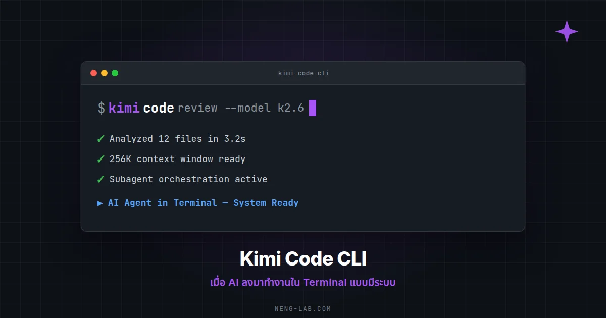

# Kimi Code CLI: เมื่อ AI ลงมาทำงานใน Terminal แบบมีระบบ

หลังจากใช้ Kimi Code CLI มากว่า 20 ชั่วโมงบนโปรเจกต์ส่วนตัว ผมพบว่าเครื่องมือนี้ไม่ได้เป็นแค่ "AI ที่พิมพ์คำสั่งให้" แต่เป็นระบบที่มีโครงสร้างชัดเจนตั้งแต่การวางแผน การจัดการ context ยาว ๆ ไปจนถึงการ delegate งานย่อยผ่าน subagent บทความนี้ผมจะเล่าทุกอย่างที่ค้นพบจากประสบการณ์ใช้งานจริงบน neng-blog, OpenClaw และ LLM Wiki


---

## Kimi Code CLI คืออะไร?

**Kimi Code CLI** (หรือชื่อเต็มว่า Kimi Code) เป็น command-line interface สำหรับ AI coding assistant จาก Moonshot AI (Kimi) ที่ทำงานบน terminal โดยตรง ไม่ต้องเปิด browser ไม่ต้อง copy-paste โค้ดไปมา

สิ่งที่ทำได้:
- อ่านและแก้ไขไฟล์ในโปรเจกต์แบบ real-time
- รันคำสั่ง shell โดยตรง
- ค้นหาข้อมูลบนอินเทอร์เน็ตผ่าน built-in search
- ใช้งานผ่าน subagent เพื่อแบ่งงานย่อย
- จัดการ context และ memory ระยะยาว

ผมเริ่มใช้ Kimi CLI ตั้งแต่เดือนเมษายน 2026 โดยนำไปใช้กับโปรเจกต์หลัก ๆ สามตัว:

1. **neng-blog** (Hugo Static Site) — จัดการธีม, typography, ระบบคอมเมนต์ giscus
2. **OpenClaw** (Multi-Agent System) — จัดการ gateway, RAG, การเชื่อมต่อ LINE/Telegram
3. **LLM Wiki** (Knowledge Base) — บันทึกความรู้, skills, workflows

---

## สถาปัตยกรรมและการตั้งค่าที่สำคัญ

### Config หลัก (`~/.kimi/config.toml`)

```toml
default_model = "kimi-code/kimi-for-coding"
default_thinking = true
default_yolo = false

[models."kimi-code/kimi-for-coding"]
provider = "managed:kimi-code"
model = "kimi-for-coding"
max_context_size = 262144        # 256K context window
capabilities = ["video_in", "thinking", "image_in"]

[providers."managed:kimi-code"]
type = "kimi"
base_url = "https://api.kimi.com/coding/v1"

[loop_control]
max_steps_per_turn = 100
max_retries_per_step = 3
reserved_context_size = 50000
compaction_trigger_ratio = 0.85   # Compact context เมื่อถึง 85%

[background]
max_running_tasks = 4
read_max_bytes = 30000
agent_task_timeout_s = 900        # 15 นาทีต่อ subagent task
```

### จุดเด่นที่ทำให้ Kimi CLI แตกต่าง

| Setting | ค่า | ความหมาย |
|---------|-----|----------|
| `max_context_size` | 262,144 tokens | ~256K context window อ่านไฟล์ใหญ่ได้สบาย |
| `compaction_trigger_ratio` | 0.85 | เริ่ม compact เมื่อ context ถึง 85% |
| `reserved_context_size` | 50,000 tokens | สำรองพื้นที่สำหรับ system prompt |
| `max_steps_per_turn` | 100 | จำกัด tool calls ต่อรอบ |
| `agent_task_timeout_s` | 900 | Subagent timeout 15 นาที |

**Context Window 256K** นี่แหละคือจุดขายหลัก แปลว่าอ่านไฟล์ขนาดใหญ่ เช่น codebase ทั้งหมด หรือเอกสารยาว ๆ ได้ในครั้งเดียว ไม่ต้องแบ่งส่วนให้ยุ่งยาก



---

## Skills System: 23+ Skills ที่ปรับแต่งได้

Kimi CLI มีระบบ **Skills** ที่เป็น modular instructions สำหรับงานเฉพาะทาง ติดตั้งอยู่ที่ `~/.kimi/skills/`

### Skills จาก Agent Skills (Addy Osmani)

| หมวดหมู่ | Skills |
|----------|--------|
| **Define** | `idea-refine`, `spec-driven-development` |
| **Plan** | `planning-and-task-breakdown`, `milestone-workflow` |
| **Build** | `incremental-implementation`, `test-driven-development`, `context-engineering`, `source-driven-development`, `frontend-ui-engineering`, `api-and-interface-design` |
| **Verify** | `verification-loop`, `browser-testing-with-devtools`, `debugging-and-error-recovery` |
| **Review** | `code-review-and-quality`, `code-simplification`, `security-and-hardening`, `performance-optimization` |
| **Ship** | `git-workflow-and-versioning`, `ci-cd-and-automation`, `deprecation-and-migration`, `documentation-and-adrs`, `shipping-and-launch` |

### Skills ที่ดัดแปลงเพิ่ม

| Skill | ใช้เมื่อไหร่ |
|-------|-------------|
| `cost-aware-execution` | Optimize token usage |
| `research-first` | Research ก่อน coding |
| `subagent-orchestration` | Delegate งานย่อย |
| `continuous-learning` | สรุปบทเรียน |
| `context-compaction` | จัดการ context ยาว |

### Skills พื้นฐานอื่น ๆ

- `obsidian-markdown` — จัดการ Obsidian Flavored Markdown
- `defuddle` — ดึง clean markdown จาก web pages
- `kimi-cli-help` — ช่วยเหลือการใช้ Kimi CLI
- `memory-space` — จัดการความจำระยะยาว

---

## The Kimi Agent Loop: Workflow 6 ขั้นตอน

จากการปรับใช้ skills ร่วมกัน ได้ workflow ที่ใช้งานจริง:

```
Plan → Research → Execute → Verify → Learn → Compact
 ↑______________________________________________↓
```

### ขั้นตอนละเอียด

**1. Plan** (`milestone-workflow` + `planning-and-task-breakdown`)
- แบ่งงานใหญ่ → Milestone → Slice → Task
- สร้างไฟล์ plan: `M001-ROADMAP.md`, `S01-PLAN.md`, `T01-PLAN.md`

**2. Research** (`research-first` + `source-driven-development`)
- ค้นหา official docs ก่อน implement
- สรุป findings ลง `M001-RESEARCH.md`

**3. Execute** (`incremental-implementation` + `test-driven-development`)
- ทำงานทีละ slice (ไม่ทีละไฟล์ใหญ่ ๆ)
- Failing test → Implement → Pass

**4. Verify** (`verification-loop` + `code-review-and-quality`)
- Static checks (lint, type)
- Build verification
- Test execution
- Security scan
- Behavioral verification

**5. Learn** (`continuous-learning`)
- สกัด patterns ที่ค้นพบ
- อัปเดต `AGENTS.md` หรือ `KNOWLEDGE.md`
- เขียน `T01-SUMMARY.md`

**6. Compact** (`context-compaction`)
- สรุปสถานะปัจจุบัน
- โหลดเฉพาะ context จำเป็นสำหรับ task ถัดไป
- หรือเริ่ม session ใหม่

---

## Memory และ Context Management

### Long-term Memory (`~/.kimi/memory.md`)

Kimi CLI สนับสนุนการจัดการความจำระยะยาวผ่าน skill `memory-space`:

```markdown
# Memory Space

## Project Context
- ชื่อโปรเจกต์: ...
- เทคโนโลยีหลัก: ...

## Key Decisions
| วันที่ | การตัดสินใจ | เหตุผล |

## User Preferences
- สไตล์การตอบ: ...
- ข้อจำกัด: ...

## Session History
- ครั้งล่าสุดทำอะไร: ...
- ปัญหาที่ยังค้างอยู่: ...
```

### Context Compaction

เมื่อ context เต็ม (trigger ที่ 85%) Kimi จะ:
1. สรุปบทสนทนาที่ผ่านมา
2. เก็บเฉพาะ decisions และ action items
3. ลบรายละเอียด implementation ที่ไม่จำเป็น
4. บันทึกลงไฟล์ memory

---

## Use Cases จากประสบการณ์จริง

### Use Case 1: Typography Unification บน neng-blog

**สถานการณ์:** ปรับ typography ให้ใช้ Modular Scale แบบ Major Third (1.25×)

**วิธีทำ:**
1. Plan: แบ่งเป็น mobile typography + desktop typography
2. Research: ดูว่า Stack Theme ใช้ `html { font-size: 62.5%; }` (1rem = 10px)
3. Execute: สร้าง CSS variables `--home-hero`, `--home-section`, ฯลฯ
4. Verify: `hugo --minify` build ผ่าน
5. Deploy: `git push` → GitHub Actions deploy

**ผลลัพธ์:** Homepage typography มี scale ที่สอดคล้องกัน ไม่มี scattered rules ที่ซ้ำซ้อน

### Use Case 2: Custom Giscus Theme

**สถานการณ์:** สร้างธีม giscus ที่เข้ากับ neng-blog (Teal/Aqua)

**วิธีทำ:**
1. Research: อ่าน giscus CONTRIBUTING.md ดูโครงสร้าง theme CSS
2. Execute: สร้าง `giscus-teal-light.css` + `giscus-teal-dark.css`
3. Fix Bug: ใช้ `MutationObserver` แก้ปัญหา iframe โหลดช้า
4. Verify: Toggle light/dark บนเว็บ → giscus เปลี่ยนสีตาม

**ผลลัพธ์:** Comment section ใช้สีเดียวกับบล็อก ไม่มี theme ที่เข้ากันใน giscus built-in

### Use Case 3: OpenClaw Gateway RAM Investigation

**สถานการณ์:** OpenClaw gateway ใช้ RAM 1.16 GB ผิดปกติ

**วิธีทำ:**
1. Research: ตรวจสอบ process ID ของ `openclaw-gateway` บน Node.js
2. Debug: ดู memory metrics พบว่าเป็น memory leak ปกติของ long-running Node.js process
3. Fix: รีสตาร์ท process
4. Verify: RAM ลดเหลือ ~596 MB (ลด 49%)

**ผลลัพธ์:** RAM กลับมาปกติ ตั้ง cron รีสตาร์ทอัตโนมัติ

---

## Subagent Orchestration: แบ่งงานให้ AI ช่วยกันทำ

Kimi CLI สนับสนุนการใช้ **Subagent** เพื่อ delegate งานย่อย:

```
"Subagent-orchestration:
- ส่ง subagent A ไปรีวิว security ของ auth slice
- ส่ง subagent B ไปเช็ค test coverage
- ฉันจะรอสรุปผลจากทั้งสองก่อน proceed"
```

### ข้อดี
- แยก context ไม่ให้ปนกัน
- ทำงานขนานได้ (parallel)
- จำกัด scope ของแต่ละ task

### ข้อจำกัด
- Subagent timeout: 15 นาที (ตั้งค่าใน config)
- Max concurrent tasks: 4
- ต้องรอ approval สำหรับบางคำสั่ง (ถ้าไม่ใช้ yolo mode)

---

## Plan Mode กับ Yolo Mode

### Plan Mode
- ใช้สำหรับงานใหญ่ที่ต้องวางแผนก่อน
- Agent จะเขียน plan file แล้วขอ user approve ก่อน execute
- User สามารถเลือก approach ได้หลายตัวเลือก

### Yolo Mode (`default_yolo = false`)
- ถ้าเปิด (`true`) Kimi จะทำงานโดยไม่ขอ approve
- ใช้กับงานที่ trust ได้ เช่น lint, format, refactor ที่ไม่เปลี่ยน behavior
- สำหรับ production deploy หรือการแก้ไขสำคัญ → ปิด yolo mode เพื่อความปลอดภัย

---

## Cost-Aware Execution

Kimi CLI ไม่มี built-in cost tracking แต่สามารถประยุกต์ใช้หลักการได้:

| เทคนิค | ผลลัพธ์ |
|--------|---------|
| ใช้ `context-compaction` บ่อย ๆ | Context ยาว = token สูง |
| Delegate งานง่ายให้ subagent | Subagent มี context สั้น = ถูกกว่า |
| `research-first` ก่อน | ลด rework ที่แพงที่สุด |
| `verification-loop` ต่อเนื่อง | จับ bug ตั้งแต่ต้น |

---

## สถิติการใช้งานจริง

จากการใช้งานจริง (เมษายน 2026):

| Metric | ค่า |
|--------|-----|
| Sessions สะสม | 5+ sessions |
| Skills ติดตั้ง | 23+ skills |
| Projects ที่จัดการ | neng-blog, OpenClaw, LLM Wiki |
| Commits ผ่าน Kimi | 20+ commits |
| ภาษาที่ใช้ | Thai, English |
| Context window ใช้งาน | สูงสุด ~256K |

---

## ข้อดี vs ข้อเสีย

### ข้อดี
- ✅ **Context window ใหญ่ (256K)** — อ่านไฟล์ใหญ่ ๆ ได้สบาย
- ✅ **Skills system ยืดหยุ่น** — ปรับแต่ง workflow ได้ตาม project
- ✅ **Subagent ทำงานขนานได้** — เร็วขึ้นเมื่องานแยกส่วนได้
- ✅ **Plan mode** — ปลอดภัยสำหรับงานใหญ่
- ✅ **Memory system** — จดจำบริบข้าม session

### ข้อเสีย
- ❌ **ไม่มี built-in cost tracking** — ต้องประมาณเอง
- ❌ **Subagent timeout 15 นาที** — งานใหญ่อาจไม่เสร็จ
- ❌ **ไม่มี persistent state ระหว่าง session** — ต้องพึ่ง memory file
- ❌ **Yolo mode อันตรายถ้าใช้ผิด** — อาจ push โค้ดที่ไม่ได้ตรวจสอบ

---

## บทสรุป

Kimi Code CLI เป็นเครื่องมือที่มีประสิทธิภาพสำหรับนักพัฒนาที่ต้องการ AI assistant ทำงานบน terminal โดยเฉพาะเมื่อผสมผสานกับ **skills system** และ **structured workflows** จะช่วยให้การทำงานเป็นระบบมากขึ้น

สิ่งสำคัญที่สุดคือการ **จัดการ context** และ **วางแผนก่อน execute** — สองสิ่งนี้ช่วยลด rework และเพิ่มคุณภาพของงานที่ส่งมอบ

สำหรับคนที่กำลังมองหา AI coding assistant ที่ทำงานบน terminal ได้จริง ๆ มี context window ใหญ่ และปรับแต่ง workflow ได้ Kimi CLI ถือเป็นตัวเลือกที่น่าสนใจครับ

---

## ส่วนอ้างอิง

1. [Kimi Code CLI Documentation](https://kimi-cli.com/en/guides/getting-started.html)
2. [Agent Skills by Addy Osmani](https://github.com/addyosmani/agent-skills)
3. [Moonshot AI Platform](https://platform.moonshot.cn/)
4. [Kimi Code Overview](https://kimi.com/coding)
5. [Everything Claude Code (ECC)](https://github.com/anthropics/claude-code)
6. [GSD-2 Framework](https://github.com/gsd-developers/gsd-2)
7. [Obsidian Markdown](https://help.obsidian.md/Editing+and+formatting/Obsidian+Flavored+Markdown)
8. [Defuddle](https://github.com/kepano/defuddle)
9. [Hugo Static Site Generator](https://gohugo.io/)
10. [Giscus Comment System](https://giscus.app/)
