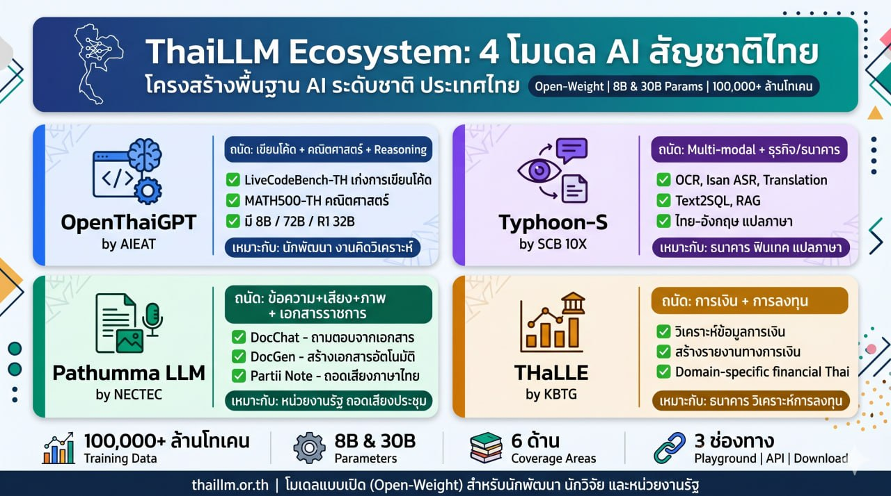

# ThaiLLM Ecosystem: 4 โมเดล AI สัญชาติไทย ที่เข้าใจคนไทยมากกว่าต่างชาติ

*ภาพ: ปรางค์วัดอรุณ | ที่มา: [Wikimedia Commons](https://commons.wikimedia.org/wiki/File:The_Prang_of_Wat_Arun.jpg) โดย Juanitoooww | [CC BY-SA 4.0](https://creativecommons.org/licenses/by-sa/4.0/)*

ตอนที่ ChatGPT เพิ่งเปิดตัว หลายคนอาจเคยลองให้มันแปลภาษาไทย แล้วรู้สึกว่าผลลัพธ์ดูดีในระดับหนึ่ง แต่พอเอาไปใช้งานจริง กลับพบว่า AI เข้าใจภาษาไทยได้ไม่ลึกซึ้งนัก บางครั้งก็แปลผิดบริบท หรือใช้คำที่ฟังดูถูกแต่ไม่เป็นธรรมชาติสำหรับคนไทย ที่สำคัญคือ AI จากต่างชาติมักไม่เข้าใจภาษาไทย หรือเอกสารภาษาไทยอย่างแท้จริง

นั่นคือจุดเริ่มต้นของ **ThaiLLM** ชื่อเต็มว่า Thai Large Language Model โครงการรัฐ-เอกชนที่พัฒนา AI สัญชาติไทยขึ้น มีจุดมุ่งให้ AI ที่เข้าใจภาษาไทย วัฒนธรรม และบริบทความที่เป็นเอกลักษณ์ และทุกโมเดลที่พัฒนาขึ้นต่างก็มีจุดเด่นที่ชัดเจน ช่วยให้ผู้ใช้งานสามารถเลือกใช้งานตามความต้องการได้ ในบทความนี้ ผมจะพาทุกคนไปที่รู้จัก 4 โมเดลหลัก ที่พัฒนาต่อยอดจาก ThaiLLM และว่าแต่ละตัวถนัดอะไร

---

## ThaiLLM คืออะไร และทำไมถึงสำคัญ

ThaiLLM เป็นโครงการร่วมมือของหลายหน่วยงาน ทั้งภาครัฐ และเอกชน เพื่อสร้าง AI ที่เข้าใจภาษาไทยแบบลึกซึ้ง หลักๆ คือมี **NECTEC (สวทช.)** ในฐานะประธาน ร่วมกับ **BDI, VISTEC, AIEAT, AIAT, มหาวิทยาลัยมหิดล และจุฬาลงกรณ์**

จุดเด่นที่สำคัญคือ ThaiLLM ได้รวบรวมข้อมูลภาษาไทยมากกว่า **100,000 ล้านโทเคน** ครอบคลุมทั้งภาษา ภาษาราชการ วัฒนธรรม การศึกษา งานวิจัย และการแพทย์ ในระยะแรก ThaiLLM มีให้ใช้งานฟรีใน 2 ขนาด คือ **8B** และ **30B** พารามิเตอร์ ผ่าน 3 ช่องทาง ได้แก่ **Playground** (ทดลองใช้งาน) **API** (สำหรับนักพัฒนา) และ **Download** (ดาวน์โหลดโมเดลไปรันเอง)

จุดขายที่สำคัญของ ThaiLLM คือ มันเป็น **Open-Weight Model** หมายความว่าทุกคนสามารถเข้าถึงโครงสร้าง ตรวจสอบได้ และนำไปพัฒนาต่อยอดได้ ไม่ใช่แบบ Black Box ที่แอบทุกข้อมูลไว้ภายในบริษัทเดียว ซึ่งสำคัญในยุคที่ AI จะทำงานได้ว่าอาจมีอคติที่ซ่อนเร้นมากๆ แต่เราไม่อาจรู้ได้ว่า AI ให้คำตอบแบบใด เพราะอะไรที่ทำให้มันคิดแบบนี้ ได้แก่จากข้อมูลอะไรบ้าง

---

## 1. OpenThaiGPT — สำหรับนักเขียนโค้ด นักคิดวิเคราะห์

**พัฒนาโดย:** AIEAT (สมาคมผู้ประกอบการปัญญาประดิษฐ์ AI ประเทศไทย)

OpenThaiGPT เป็นโมเดลที่มุ่งเน้นไปที่ **การเขียนโค้ด คณิตศาสตร์ และ Reasoning** โดยเฉพาะบนชุดทดสอบ LiveCodeBench-TH ซึ่งวัดความสามารถในการเขียนโค้ดภาษาไทย และ MATH500-TH ที่วัดความเข้าใจทางคณิตศาสตร์

จุดเด่นที่น่าสนใจคือ OpenThaiGPT มีหลายเวอร์ชันให้เลือกใช้งาน ไม่ว่าจะเป็นขนาด 8B ที่เหมาะกับงานทั่วไป แต่ยังมีขนาด **72B** สำหรับงานที่ซับซ้อนกว่า รวมถึง **R1 32B** ที่เป็นโมเดล Reasoning โดยเฉพาะ สามารถแสดงวิธีคิดแก้ปัญหาแบบ step-by-step ได้

**ใครที่เหมาะกับ OpenThaiGPT:**
- นักพัฒนาที่ต้องการเขียนโค้ดภาษาไทย
- นักคิดวิเคราะห์ที่ต้องการแก้ปัญหาทางคณิตศาสตร์
- ผู้ที่ต้องการสร้าง Chatbot ที่มีทักษะวิศวกรรม

---

## 2. Typhoon-S — สำหรับงานธุรกิจ และธนาคาร

**พัฒนาโดย:** SCB 10X (กลุ่มวิจัย AI ของ SCB)

Typhoon-S เป็นโมเดลที่มุ่งเน้นไปที่ **การทำงานแบบ Multi-modal** หมายความว่า AI ตัวนี้สามารถรับข้อมูลได้หลากหลายรูปแบบ ทั้งข้อความ เสียง และภาพ นอกจากนี้ยังมีความสามารถระดับความรู้ทางภาษาไทยได้ลึกกว่าโมเดลทั่วไป ด้วยการประมวลผลที่รวดเร็วและเข้าใจคำสั่งภาษาไทยได้ดี

จุดเด่นที่น่าสนใจของ Typhoon-S คือมี ecosystem ที่ครบวงจร ไม่ว่าจะแค่โมเดลภาษา แต่ยังมี Typhoon OCR (อ่านเอกสารภาษาไทย), Typhoon Isan ASR (ถอดเสียงภาษาอีสาน) และ Typhoon Translate (แปลภาษาไทย-อังกฤษ) นอกนี้ยังรองรับ Text2SQL และ RAG ซึ่งเป็นเทคโนโลยีที่นิยมใช้ในวงการธนาคารโดยตรง

**ใครที่เหมาะกับ Typhoon-S:**
- ธนาคารที่ต้องการวิเคราะห์ข้อมูลด้วย Text2SQL
- งานที่ต้องการแปลภาษาไทย-อังกฤษที่แม่นยำ
- ระบบที่ต้องการอ่านเอกสารภาษาไทย และถอดเสียงภาษาอีสาน
- ฟินเทคที่ต้องการสร้าง Chatbot สำหรับลูกค้า

---

## 3. Pathumma LLM — ผู้ช่วยในหน่วยงานรัฐ

**พัฒนาโดย:** NECTEC (สวทช. เอง)

Pathumma LLM (อ่านว่า ปทุมมา) เป็นโมเดลที่ออกแบบมาสำหรับการทำงานในภาครัฐ โดยเฉพาะ บนการทำงานแบบ Multi-modal ที่รวมข้อความ เสียง และภาพ เข้าถึงด้วยกัน มีบริการเด่นๆ ที่ออกแบบมาสำหรับหน่วยงานรัฐโดยเฉพาะ

บริการหลักๆ ของ Pathumma มีดังนี้
- **DocChat:** ระบบถามตอบข้อมูลจากเอกสารได้ รองรับไฟล์ PDF, Word, และเว็บไซต์ เหมาะสำหรับการค้นหาข้อมูลในนโยบาย คู่มือ หรือเอกสารราชการ
- **DocGen:** ช่วยสร้างเอกสารภาษาไทยอัตโนมัติ ช่วยให้อ่านและเข้าใจภาษาราชการ ช่วยลดระยะเวลาในการทำงานประจำวัน
- **Partii Note:** ถอดความเสียงภาษาไทยอัตโนมัติ รองรับทั้งการประชุม สัมมนา และการบรรยาย โดยสามารถแยกผู้พูดได้ด้วย

**ใครที่เหมาะกับ Pathumma:**
- ข้าราชการ หน่วยงานรัฐ ที่ต้องการค้นหาข้อมูลจากเอกสารราชการจำนวนมาก
- ผู้ที่ต้องการถอดเสียงการประชุม สัมมนา หรือบรรยาย
- ผู้ที่ต้องการสร้างเอกสารภาษาไทยอัตโนมัติ เช่น รายงาน จดหมาย หรือข้อเสนอ
- ผู้ที่ต้องการวิเคราะห์ภาพ และเสียงพร้อมกัน

---

## 4. THaLLE — นักวิเคราะห์การลงทุน

**พัฒนาโดย:** KBTG (กลุ่มเทคโนโลยี การเงินกสิกร)

THaLLE (อ่านว่า ทะเล่) ชื่อเต็มว่า Text Hyperlocally Augmented Large Language Extension เป็นโมเดลที่ออกแบบมาสำหรับงานด้านการเงินโดยเฉพาะ มีจุดเด่นที่น่าสนใจคือ ที่ KBTG ได้นำข้อมูลทางการเงิน การลงทุน และระบบทางการเงินในประเทศไทยมาปรับใช้งานกับโมเดล ทำให้ AI เข้าใจทางภาษาการเงินได้ลึกซึ้ง

ข้อดีของ THaLLE คือ มันสามารถวิเคราะห์ข้อมูลทางการเงิน สร้างรายงานทางการเงิน และอ่านข้อมูลทางภาษาการเงินได้ดีกว่า AI ทั่วไป เพราะโมเดลทั่วไปอาจไม่คุ้นเคยกับคำศัพทางภาษาการเงิน หรือกฎหมายทางการเงินที่เป็นเอกลักษณ์ของไทย ซึ่ง THaLLE ถูกออกแบบมาเพื่อแก้ปัญหานี้โดยเฉพาะ

**ใครที่เหมาะกับ THaLLE:**
- ธนาคารที่ต้องการวิเคราะห์ข้อมูลทางการเงิน และสร้างรายงาน
- นักลงทุนที่ต้องการวิเคราะห์ข้อมูลทางภาษาการเงินที่เป็นภาษาไทย
- บุคคลที่ต้องการ Chatbot สำหรับให้ข้อมูลทางการเงินแบบลึกซึ้ง

---

## ตารางเปรียบเทียบข้อมูล 4 โมเดล

| หัวข้อ | OpenThaiGPT | Typhoon-S | Pathumma | THaLLE |
|-----------|-------------|-----------|----------|--------|
| **พัฒนาโดย** | AIEAT | SCB 10X | NECTEC | KBTG |
| **จุดเด่น** | เขียนโค้ด คณิตศาสตร์ Reasoning | Multi-modal ธุรกิจ | ข้อความ+เสียง+ภาพ เอกสารราชการ | การเงิน การลงทุน |
| **จุดแข็ง** | LiveCodeBench-TH, MATH500-TH | OCR, Isan ASR, Text2SQL, RAG | DocChat, DocGen, Partii Note | วิเคราะห์ข้อมูลการเงิน |
| **ขนาด** | 8B / 72B / R1 32B | 8B | 8B | 8B |
| **เหมาะกับ** | นักพัฒนา งานคิดวิเคราะห์ | ธนาคาร ฟินเทค แปลภาษา | หน่วยงานรัฐ ถอดเสียงประชุม | ธนาคาร วิเคราะห์การลงทุน |
| **ทดลอง** | openthaigpt.aieat.or.th | opentyphoon.ai | aiforthai.in.th | ผ่าน KBTG |

---

## วิธีเริ่มต้นใช้งาน

สำหรับผู้ที่อยากลองใช้งาน ThaiLLM แต่ยังไม่รู้ว่าจะเริ่มต้นจากตรงไหน ผมขอสรุปวิธีง่ายๆ ดังนี้

1. **ทดลองผ่าน Playground:** เข้าไปที่ thaillm.or.th แล้วเลือก Playground เพื่อทดลองพิมพ์คำถามง่ายๆ ไม่ต้องติดตั้งอะไร
2. **ใช้งานผ่าน API:** สำหรับนักพัฒนาที่ต้องการเชื่อมต่อกับระบบ สามารถขอ API Key และเรียกใช้งานได้ทันที
3. **ดาวน์โหลดโมเดลมารันเอง:** สำหรับผู้ที่มีคอมพิวเตอร์ที่มีกำลังภาพพอเพียงพอ สามารถดาวน์โหลดโมเดลไปรันบนเครื่องตัวเองได้ โดยทั้ง OpenThaiGPT, Typhoon-S, และ Pathumma ต่างๆ มีส่วนหนึ่งที่อนุญาตให้นำโมเดลไปพัฒนาต่อยอดได้

อีกทางที่น่าสนใจสำหรับผู้ที่เพิ่งเริ่มต้นคือ ทุกโมเดลที่พัฒนาออกมาบนฐานว่า เป็น **Open-Weight** หมายความว่าทุกคนสามารถนำไปพัฒนาต่อยอด ไม่ว่าจะเป็นผู้ใช้งานจำนวนน้อย หรือผู้ใช้งานจำนวนมาก ในอนาคต อาจใช้งาน AI ที่มีความสามารถในการปรับใช้ในงานประจำวัน วิเคราะห์ข้อมูล หรือทำงานวิจัย โดยไม่ต้องกังวลน้ำหนักสำหรับการใช้ AI ที่ต้องจ่ายค่าบริการรายเดือน หรือมีข้อจำกัดในการเก็บรักษาข้อมูลลูกค้า

---

## ปิดท้าย

ThaiLLM เป็นก้าวสำคัญในการพัฒนา AI ของไทย ที่ช่วยให้ประเทศมี AI ที่เข้าใจคนไทยแบบลึกซึ้ง ทั้งในภาษา วัฒนธรรม และบริบทความที่เป็นเอกลักษณ์ และทุกโมเดลที่พัฒนาขึ้นต่างก็มีจุดเด่นที่ชัดเจน ช่วยให้ผู้ใช้งานสามารถเลือกใช้งานตามความต้องการได้

สำหรับผมเอง ในฐานะนักวิชาการพัฒนาชุมชน ผมมองเห็นว่า Pathumma LLM อาจจะเป็นตัวเลือกที่น่าสนใจที่สุด เนื่องจากงานส่วนใหญ่ของผมมีเอกสารภาษาไทย และการถอดเสียงประชุม ซึ่งเป็นสิ่งที่ Pathumma ทำได้ดีที่สุด อย่างไรก็ตาม ทุกโมเดลที่พัฒนาขึ้นล้วนมีข้อดีๆ ที่น่าสนใจและน่านำไปใช้งานครับ และผมจะติดตามทดลองใช้งานแต่ละตัวและมาแชร์ประสบการณ์ให้ทุกท่านได้อีกครั้ง และหากใครได้ลองใช้งานแล้วมีประสบการณ์อะไร กลับมาบอกกันได้เหมือนกันครับ เพราะในโลกที่ AI กำลังเติบโต การมี AI ที่เข้าใจภาษาไทย และเข้าใจบริบทความท้องถิ่น ถือเป็นสิ่งที่ดี ที่จะทำให้งาน AI ในหน่วยงานของเรามีประสิทธิภาพมากขึ้น

---

## ส่วนอ้างอิง

- [เว็บไซต์ ThaiLLM](https://thaillm.or.th/)
- [เว็บไซต์ OpenThaiGPT](https://openthaigpt.aieat.or.th/)
- [เว็บไซต์ Typhoon](https://opentyphoon.ai/)
- [ข้อมูล Pathumma LLM - NECTEC](https://www.nectec.or.th/innovation/innovation-service/pathumma-llm.html)
- [บริการ Pathumma LLM - AI for Thai](https://aiforthai.in.th/pathumma-llm)
- [เว็บไซต์ KBTG](https://www.kbtg.tech/)
- [บทความประกาศเปิดตัว ThaiLLM - NSTDA](https://www.nstda.or.th/home/news_post/s-and-t-implementation-thai-llm/)
- [สไลด์ OpenThaiGPT 1.6 และ R1](https://openthaigpt.aieat.or.th/)
- [รายงานวิจัย Thai Financial Domain Adaptation of THaLLE](https://arxiv.org/html/2411.18242v1)
- [สไลด์ Chinda Thai LLM 4B API](https://iapp.co.th/th/blog/introducing-chinda-llm-api-free-thai-language-model)
